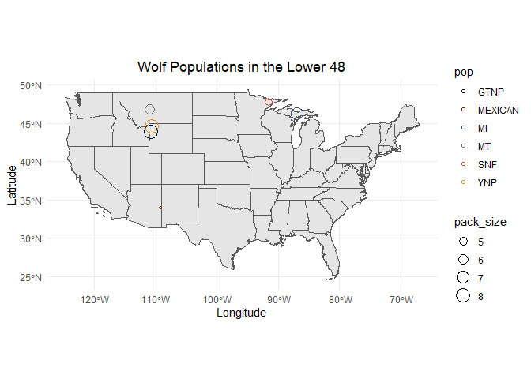

## Instructions
Answer the following questions and complete the exercises in RMarkdown. Please embed all of your code and push your final work to your repository. Your final lab report should be organized, clean, and run free from errors. Remember, you must remove the `#` for the included code chunks to run. Be sure to add your name to the author header above. For any included plots, make sure they are clearly labeled. You are free to use any plot type that you feel best communicates the results of your analysis.  

Make sure to use the formatting conventions of RMarkdown to make your report neat and clean!  

## Load the libraries

```r
library(tidyverse)
library(janitor)
library(here)
library(ggmap)
library(albersusa)
library(paletteer)
```

## Load the Data
We will use two separate data sets for this homework.  

1. The first [data set](https://rcweb.dartmouth.edu/~f002d69/workshops/index_rspatial.html) represent sightings of grizzly bears (Ursos arctos) in Alaska.  
2. The second data set is from Brandell, Ellen E (2021), Serological dataset and R code for: Patterns and processes of pathogen exposure in gray wolves across North America, Dryad, [Dataset](https://doi.org/10.5061/dryad.5hqbzkh51).  

1. Load the `grizzly` data and evaluate its structure. As part of this step, produce a summary that provides the range of latitude and longitude so you can build an appropriate bounding box.

```r
grizzly <- read_csv(here("lab12", "data", "bear-sightings.csv"))
```

```
## 
## ── Column specification ────────────────────────────────────────────────────────
## cols(
##   bear.id = col_double(),
##   longitude = col_double(),
##   latitude = col_double()
## )
```


```r
grizzly %>% 
  select(latitude, longitude) %>% 
  summary
```

```
##     latitude       longitude     
##  Min.   :55.02   Min.   :-166.2  
##  1st Qu.:58.13   1st Qu.:-154.2  
##  Median :60.97   Median :-151.0  
##  Mean   :61.41   Mean   :-149.1  
##  3rd Qu.:64.13   3rd Qu.:-145.6  
##  Max.   :70.37   Max.   :-131.3
```

2. Use the range of the latitude and longitude to build an appropriate bounding box for your map.

```r
lat <- c(55.02, 70.37)
long <- c(-166.2, -131.3)
bbox <- make_bbox(long, lat, f = 0.05)
bbox
```

```
##      left    bottom     right       top 
## -167.9450   54.2525 -129.5550   71.1375
```

3. Load a map from `stamen` in a terrain style projection and display the map.

```r
grizzly_map <- get_map(bbox, maptype = "terrain", source = "stamen")
```

```
## Map tiles by Stamen Design, under CC BY 3.0. Data by OpenStreetMap, under ODbL.
```


```r
ggmap(grizzly_map)
```

<!-- -->

4. Build a final map that overlays the recorded observations of grizzly bears in Alaska.

```r
ggmap(grizzly_map) +
  geom_point(data = grizzly, aes(longitude, latitude), size = 0.25, shape = 6, color = "brown") + 
  labs(x = "Longitude",
       y = "Latitude",
       title = "Grizzly Bear Observations in Alaska")
```

<!-- -->

5. Let's switch to the wolves data. Load the data and evaluate its structure.

```r
wolves <- read_csv(here("lab12", "data", "wolves_data", "wolves_dataset.csv"))
```

```
## 
## ── Column specification ────────────────────────────────────────────────────────
## cols(
##   .default = col_double(),
##   pop = col_character(),
##   age.cat = col_character(),
##   sex = col_character(),
##   color = col_character()
## )
## ℹ Use `spec()` for the full column specifications.
```

```r
wolves
```

```
## # A tibble: 1,986 x 23
##    pop     year age.cat sex   color   lat  long habitat human pop.density
##    <chr>  <dbl> <chr>   <chr> <chr> <dbl> <dbl>   <dbl> <dbl>       <dbl>
##  1 AK.PEN  2006 S       F     G      57.0 -158.    254.  10.4           8
##  2 AK.PEN  2006 S       M     G      57.0 -158.    254.  10.4           8
##  3 AK.PEN  2006 A       F     G      57.0 -158.    254.  10.4           8
##  4 AK.PEN  2006 S       M     B      57.0 -158.    254.  10.4           8
##  5 AK.PEN  2006 A       M     B      57.0 -158.    254.  10.4           8
##  6 AK.PEN  2006 A       M     G      57.0 -158.    254.  10.4           8
##  7 AK.PEN  2006 A       F     G      57.0 -158.    254.  10.4           8
##  8 AK.PEN  2006 P       M     G      57.0 -158.    254.  10.4           8
##  9 AK.PEN  2006 S       F     G      57.0 -158.    254.  10.4           8
## 10 AK.PEN  2006 P       M     G      57.0 -158.    254.  10.4           8
## # … with 1,976 more rows, and 13 more variables: pack.size <dbl>,
## #   standard.habitat <dbl>, standard.human <dbl>, standard.pop <dbl>,
## #   standard.packsize <dbl>, standard.latitude <dbl>, standard.longitude <dbl>,
## #   cav.binary <dbl>, cdv.binary <dbl>, cpv.binary <dbl>, chv.binary <dbl>,
## #   neo.binary <dbl>, toxo.binary <dbl>
```

```r
wolves <- clean_names(wolves)
wolves
```

```
## # A tibble: 1,986 x 23
##    pop     year age_cat sex   color   lat  long habitat human pop_density
##    <chr>  <dbl> <chr>   <chr> <chr> <dbl> <dbl>   <dbl> <dbl>       <dbl>
##  1 AK.PEN  2006 S       F     G      57.0 -158.    254.  10.4           8
##  2 AK.PEN  2006 S       M     G      57.0 -158.    254.  10.4           8
##  3 AK.PEN  2006 A       F     G      57.0 -158.    254.  10.4           8
##  4 AK.PEN  2006 S       M     B      57.0 -158.    254.  10.4           8
##  5 AK.PEN  2006 A       M     B      57.0 -158.    254.  10.4           8
##  6 AK.PEN  2006 A       M     G      57.0 -158.    254.  10.4           8
##  7 AK.PEN  2006 A       F     G      57.0 -158.    254.  10.4           8
##  8 AK.PEN  2006 P       M     G      57.0 -158.    254.  10.4           8
##  9 AK.PEN  2006 S       F     G      57.0 -158.    254.  10.4           8
## 10 AK.PEN  2006 P       M     G      57.0 -158.    254.  10.4           8
## # … with 1,976 more rows, and 13 more variables: pack_size <dbl>,
## #   standard_habitat <dbl>, standard_human <dbl>, standard_pop <dbl>,
## #   standard_packsize <dbl>, standard_latitude <dbl>, standard_longitude <dbl>,
## #   cav_binary <dbl>, cdv_binary <dbl>, cpv_binary <dbl>, chv_binary <dbl>,
## #   neo_binary <dbl>, toxo_binary <dbl>
```

6. How many distinct wolf populations are included in this study? Mae a new object that restricts the data to the wolf populations in the lower 48 US states.

```r
n_distinct(wolves$pop)
```

```
## [1] 17
```


```r
wolves %>% 
  tabyl(pop)
```

```
##      pop   n     percent
##   AK.PEN 100 0.050352467
##  BAN.JAS  96 0.048338369
##       BC 145 0.073011078
##   DENALI 154 0.077542800
##    ELLES  11 0.005538771
##     GTNP  60 0.030211480
##   INT.AK  35 0.017623364
##  MEXICAN 181 0.091137966
##       MI 102 0.051359517
##       MT 351 0.176737160
##    N.NWT  67 0.033736153
##      ONT  60 0.030211480
##    SE.AK  10 0.005035247
##      SNF  92 0.046324270
##   SS.NWT  34 0.017119839
##      YNP 383 0.192849950
##     YUCH 105 0.052870091
```

```r
wolves48 <- wolves %>% 
  filter(between(lat, 26, 50))
```

```r
n_distinct(wolves48$pop)
```

```
## [1] 6
```

```r
wolves48 %>% 
  tabyl(pop)
```

```
##      pop   n    percent
##     GTNP  60 0.05132592
##  MEXICAN 181 0.15483319
##       MI 102 0.08725406
##       MT 351 0.30025663
##      SNF  92 0.07869974
##      YNP 383 0.32763045
```


```r
#There are 17 wolf populations included in the study, but only 6 restricted to the lower 48. 
```

7. Use the `albersusa` package to make a base map of the lower 48 US states.

```r
us_comp <- usa_sf() %>% 
  filter(name!="Alaska" & name != "Hawaii")
```


```r
cnty_comp <- counties_sf()
```


```r
ggplot() +
  geom_sf(data = us_comp, size = 0.15) +
  theme_linedraw() +
  theme_minimal() +
  theme(plot.title = element_text(hjust = 0.5)) +
  labs(title = "United States Lower 48",
       x = "Longitude", 
       y = "Latitude")
```

<!-- -->

8. Use the relimited data to plot the distribution of wolf populations in the lower 48 US states.

```r
colors <- paletteer::palettes_d_names
#colors
```

```r
palette <- paletteer_d("ghibli::MononokeMedium")
palette
```

```
## <colors>
## #06141FFF #742C14FF #3D4F7DFF #657060FF #CD4F38FF #E48C2AFF #EAD890FF
```


```r
ggplot() +
  geom_sf(data = us_comp, size = 0.15) +
  theme_linedraw() +
  theme_minimal() +
  theme(plot.title = element_text(hjust = 0.5)) +
  labs(title = "Wolf Populations in the Lower 48",
       x = "Longitude", 
       y = "Latitude") + 
  geom_point(data = wolves48, aes(x = long, y = lat, color = pop), size = 2, shape = 6)+
  scale_color_manual(values = palette) 
```

<!-- -->

9. What is the average pack size for the wolves in this study by region?

```r
wolves %>% 
  group_by(pop, lat, long) %>% 
  summarize(avg_pack_size = mean(pack_size, na.rm = T))
```

```
## `summarise()` has grouped output by 'pop', 'lat'. You can override using the `.groups` argument.
```

```
## # A tibble: 17 x 4
## # Groups:   pop, lat [17]
##    pop       lat   long avg_pack_size
##    <chr>   <dbl>  <dbl>         <dbl>
##  1 AK.PEN   57.0 -158.           8.78
##  2 BAN.JAS  52.2 -117.           9.56
##  3 BC       57.9 -124.           5.88
##  4 DENALI   63.3 -151.           6.45
##  5 ELLES    80.5  -82.4          9.19
##  6 GTNP     43.8 -111.           8.1 
##  7 INT.AK   65.0 -148.           6.24
##  8 MEXICAN  33.9 -109.           4.04
##  9 MI       46.1  -86.8          7.12
## 10 MT       46.8 -111.           5.62
## 11 N.NWT    63.9 -111.           4   
## 12 ONT      50.2  -86.0          4.37
## 13 SE.AK    55.8 -131.           5   
## 14 SNF      47.7  -91.5          4.81
## 15 SS.NWT   60.8 -115.           3.55
## 16 YNP      44.6 -111.           8.25
## 17 YUCH     65.1 -143.           6.37
```

10. Make a new map that shows the distribution of wolves in the lower 48 US states but which has the size of location markers adjusted by pack size.

```r
ggplot() +
  geom_sf(data = us_comp, size = 0.15) +
  theme_linedraw() +
  theme_minimal() +
  theme(plot.title = element_text(hjust = 0.5)) +
  labs(title = "Wolf Populations in the Lower 48",
       x = "Longitude", 
       y = "Latitude") + 
  geom_point(data = wolves48, aes(x = long, y = lat, size = pack_size, color = pop), shape = 21) +
  scale_color_manual(values = palette) 
```

<!-- -->

## Push your final code to GitHub!
Please be sure that you check the `keep md` file in the knit preferences. 
