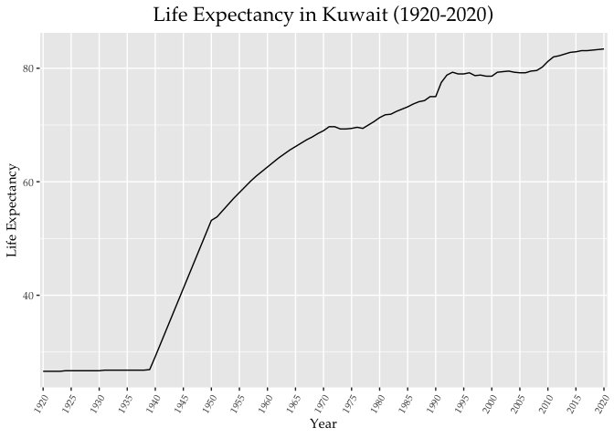
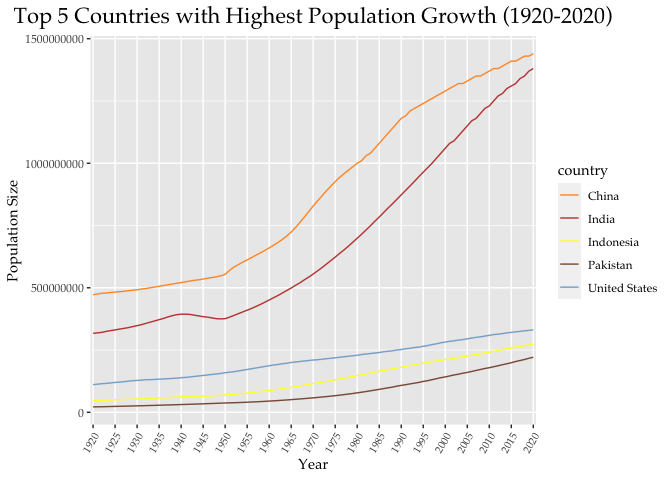
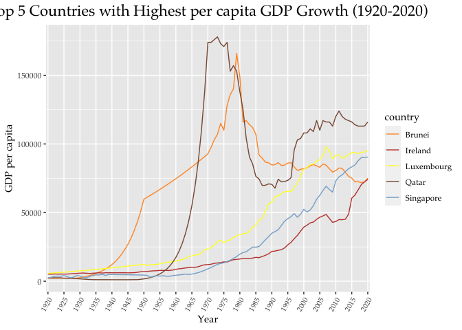
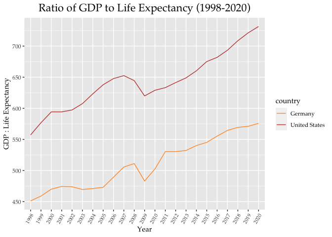

## Instructions
Answer the following questions and complete the exercises in RMarkdown. Please embed all of your code and push your final work to your repository. Your code should be organized, clean, and run free from errors. Be sure to **add your name** to the author header above. You may use any resources to answer these questions (including each other), but you may not post questions to Open Stacks or external help sites. There are 10 total questions.  

Make sure to use the formatting conventions of RMarkdown to make your report neat and clean! Your plots should use consistent aesthetics throughout. Feel free to be creative- there are many possible solutions to these questions!  

This exam is due by **12:00p on Tuesday, February 23**.  

## Load the libraries

```r
library(tidyverse)
```

```
## ── Attaching packages ─────────────────────────────────────── tidyverse 1.3.0 ──
```

```
## ✓ ggplot2 3.3.3     ✓ purrr   0.3.4
## ✓ tibble  3.1.0     ✓ dplyr   1.0.4
## ✓ tidyr   1.1.2     ✓ stringr 1.4.0
## ✓ readr   1.4.0     ✓ forcats 0.5.1
```

```
## ── Conflicts ────────────────────────────────────────── tidyverse_conflicts() ──
## x dplyr::filter() masks stats::filter()
## x dplyr::lag()    masks stats::lag()
```

```r
library(janitor)
```

```
## 
## Attaching package: 'janitor'
```

```
## The following objects are masked from 'package:stats':
## 
##     chisq.test, fisher.test
```

```r
library(here)
```

```
## here() starts at /Users/Joel/Desktop/BIS15W2021_npaxton
```

```r
options(scipen=999) #disables scientific notation when printing
library(paletteer)
```

## Gapminder
For this assignment, we are going to use data from  [gapminder](https://www.gapminder.org/). Gapminder includes information about economics, population, social issues, and life expectancy from countries all over the world. We will use three data sets, so please load all three.  

One thing to note is that the data include years beyond 2021. These are projections based on modeling done by the gapminder organization. Start by importing the data.

```r
population <- readr::read_csv("data/population_total.csv")
```

```
## 
## ── Column specification ────────────────────────────────────────────────────────
## cols(
##   .default = col_double(),
##   country = col_character()
## )
## ℹ Use `spec()` for the full column specifications.
```

```r
glimpse(population)
```

```
## Rows: 195
## Columns: 302
## $ country <chr> "Afghanistan", "Albania", "Algeria", "Andorra", "Angola", "Ant…
## $ `1800`  <dbl> 3280000, 400000, 2500000, 2650, 1570000, 37000, 534000, 413000…
## $ `1801`  <dbl> 3280000, 402000, 2510000, 2650, 1570000, 37000, 520000, 413000…
## $ `1802`  <dbl> 3280000, 404000, 2520000, 2650, 1570000, 37000, 506000, 413000…
## $ `1803`  <dbl> 3280000, 405000, 2530000, 2650, 1570000, 37000, 492000, 413000…
## $ `1804`  <dbl> 3280000, 407000, 2540000, 2650, 1570000, 37000, 479000, 413000…
## $ `1805`  <dbl> 3280000, 409000, 2550000, 2650, 1570000, 37000, 466000, 413000…
## $ `1806`  <dbl> 3280000, 411000, 2560000, 2650, 1570000, 37000, 453000, 413000…
## $ `1807`  <dbl> 3280000, 413000, 2560000, 2650, 1570000, 37000, 441000, 413000…
## $ `1808`  <dbl> 3280000, 414000, 2570000, 2650, 1570000, 37000, 429000, 413000…
## $ `1809`  <dbl> 3280000, 416000, 2580000, 2650, 1570000, 37000, 417000, 413000…
## $ `1810`  <dbl> 3280000, 418000, 2590000, 2650, 1570000, 37000, 420000, 413000…
## $ `1811`  <dbl> 3280000, 420000, 2600000, 2650, 1570000, 37000, 422000, 413000…
## $ `1812`  <dbl> 3280000, 422000, 2610000, 2650, 1570000, 37000, 429000, 413000…
## $ `1813`  <dbl> 3280000, 424000, 2620000, 2650, 1570000, 37000, 441000, 413000…
## $ `1814`  <dbl> 3280000, 426000, 2630000, 2650, 1570000, 37000, 453000, 413000…
## $ `1815`  <dbl> 3280000, 427000, 2640000, 2650, 1570000, 37000, 466000, 413000…
## $ `1816`  <dbl> 3280000, 429000, 2650000, 2650, 1570000, 37000, 479000, 413000…
## $ `1817`  <dbl> 3280000, 431000, 2660000, 2650, 1570000, 37000, 492000, 413000…
## $ `1818`  <dbl> 3280000, 433000, 2670000, 2650, 1570000, 37000, 506000, 413000…
## $ `1819`  <dbl> 3280000, 435000, 2680000, 2660, 1570000, 37000, 519000, 414000…
## $ `1820`  <dbl> 3290000, 437000, 2690000, 2670, 1580000, 37000, 531000, 416000…
## $ `1821`  <dbl> 3300000, 439000, 2690000, 2680, 1590000, 37000, 542000, 418000…
## $ `1822`  <dbl> 3310000, 441000, 2700000, 2690, 1610000, 37000, 553000, 421000…
## $ `1823`  <dbl> 3320000, 443000, 2700000, 2710, 1640000, 37000, 562000, 425000…
## $ `1824`  <dbl> 3340000, 445000, 2710000, 2730, 1660000, 37000, 572000, 429000…
## $ `1825`  <dbl> 3350000, 447000, 2710000, 2750, 1690000, 37000, 582000, 433000…
## $ `1826`  <dbl> 3370000, 449000, 2720000, 2770, 1710000, 37000, 592000, 437000…
## $ `1827`  <dbl> 3380000, 451000, 2720000, 2790, 1740000, 37000, 602000, 441000…
## $ `1828`  <dbl> 3400000, 453000, 2730000, 2810, 1760000, 37000, 613000, 445000…
## $ `1829`  <dbl> 3410000, 455000, 2730000, 2830, 1790000, 37000, 624000, 449000…
## $ `1830`  <dbl> 3430000, 457000, 2740000, 2850, 1810000, 37000, 635000, 453000…
## $ `1831`  <dbl> 3450000, 459000, 2740000, 2870, 1840000, 37000, 647000, 457000…
## $ `1832`  <dbl> 3460000, 461000, 2750000, 2890, 1870000, 37000, 659000, 461000…
## $ `1833`  <dbl> 3480000, 463000, 2750000, 2910, 1900000, 37000, 672000, 465000…
## $ `1834`  <dbl> 3490000, 465000, 2760000, 2930, 1920000, 37000, 685000, 470000…
## $ `1835`  <dbl> 3510000, 467000, 2760000, 2950, 1950000, 37000, 698000, 474000…
## $ `1836`  <dbl> 3520000, 470000, 2770000, 2970, 1980000, 37000, 712000, 478000…
## $ `1837`  <dbl> 3540000, 472000, 2770000, 2990, 2010000, 37000, 725000, 483000…
## $ `1838`  <dbl> 3550000, 474000, 2780000, 3010, 2040000, 37000, 739000, 487000…
## $ `1839`  <dbl> 3570000, 476000, 2780000, 3030, 2070000, 37000, 756000, 492000…
## $ `1840`  <dbl> 3590000, 478000, 2790000, 3060, 2100000, 37000, 776000, 496000…
## $ `1841`  <dbl> 3600000, 480000, 2790000, 3080, 2130000, 37000, 800000, 501000…
## $ `1842`  <dbl> 3620000, 482000, 2800000, 3100, 2160000, 37000, 826000, 505000…
## $ `1843`  <dbl> 3630000, 485000, 2800000, 3120, 2190000, 37000, 857000, 510000…
## $ `1844`  <dbl> 3650000, 487000, 2810000, 3140, 2230000, 37000, 888000, 515000…
## $ `1845`  <dbl> 3670000, 489000, 2810000, 3170, 2260000, 37000, 920000, 519000…
## $ `1846`  <dbl> 3680000, 491000, 2820000, 3190, 2290000, 37000, 954000, 524000…
## $ `1847`  <dbl> 3700000, 493000, 2820000, 3210, 2330000, 37000, 989000, 529000…
## $ `1848`  <dbl> 3720000, 496000, 2830000, 3230, 2360000, 37000, 1030000, 53400…
## $ `1849`  <dbl> 3730000, 498000, 2840000, 3260, 2390000, 37000, 1060000, 53900…
## $ `1850`  <dbl> 3750000, 501000, 2850000, 3280, 2420000, 37000, 1090000, 54400…
## $ `1851`  <dbl> 3770000, 505000, 2870000, 3300, 2450000, 37000, 1120000, 54900…
## $ `1852`  <dbl> 3790000, 510000, 2900000, 3320, 2470000, 37000, 1140000, 55300…
## $ `1853`  <dbl> 3810000, 515000, 2920000, 3350, 2490000, 37000, 1160000, 55800…
## $ `1854`  <dbl> 3830000, 520000, 2950000, 3370, 2510000, 37000, 1180000, 56300…
## $ `1855`  <dbl> 3840000, 525000, 2980000, 3390, 2530000, 37000, 1200000, 56800…
## $ `1856`  <dbl> 3860000, 530000, 3010000, 3420, 2550000, 37000, 1220000, 57400…
## $ `1857`  <dbl> 3880000, 535000, 3040000, 3440, 2570000, 37000, 1240000, 57900…
## $ `1858`  <dbl> 3900000, 540000, 3070000, 3460, 2600000, 36900, 1260000, 58400…
## $ `1859`  <dbl> 3920000, 545000, 3100000, 3490, 2620000, 36900, 1290000, 58900…
## $ `1860`  <dbl> 3940000, 551000, 3130000, 3510, 2640000, 36800, 1320000, 59400…
## $ `1861`  <dbl> 3960000, 556000, 3170000, 3540, 2660000, 36700, 1350000, 60000…
## $ `1862`  <dbl> 3980000, 561000, 3200000, 3560, 2680000, 36500, 1390000, 60500…
## $ `1863`  <dbl> 4000000, 567000, 3230000, 3590, 2710000, 36300, 1440000, 61000…
## $ `1864`  <dbl> 4020000, 572000, 3260000, 3610, 2730000, 36100, 1480000, 61600…
## $ `1865`  <dbl> 4040000, 578000, 3290000, 3640, 2750000, 35900, 1530000, 62100…
## $ `1866`  <dbl> 4060000, 584000, 3330000, 3660, 2780000, 35700, 1580000, 62700…
## $ `1867`  <dbl> 4080000, 589000, 3360000, 3690, 2800000, 35500, 1630000, 63300…
## $ `1868`  <dbl> 4100000, 595000, 3390000, 3710, 2820000, 35300, 1680000, 63800…
## $ `1869`  <dbl> 4120000, 601000, 3430000, 3740, 2840000, 35100, 1740000, 64400…
## $ `1870`  <dbl> 4140000, 606000, 3460000, 3760, 2870000, 35000, 1790000, 65000…
## $ `1871`  <dbl> 4160000, 612000, 3500000, 3790, 2890000, 34900, 1850000, 65500…
## $ `1872`  <dbl> 4180000, 618000, 3530000, 3820, 2910000, 34900, 1910000, 66100…
## $ `1873`  <dbl> 4210000, 624000, 3570000, 3840, 2930000, 34900, 1970000, 66700…
## $ `1874`  <dbl> 4230000, 630000, 3600000, 3870, 2940000, 34900, 2030000, 67300…
## $ `1875`  <dbl> 4250000, 636000, 3640000, 3900, 2960000, 34800, 2100000, 67900…
## $ `1876`  <dbl> 4270000, 642000, 3670000, 3920, 2980000, 34800, 2170000, 68500…
## $ `1877`  <dbl> 4290000, 648000, 3710000, 3950, 3000000, 34800, 2240000, 69100…
## $ `1878`  <dbl> 4310000, 655000, 3750000, 3980, 3020000, 34800, 2310000, 69800…
## $ `1879`  <dbl> 4330000, 661000, 3790000, 4010, 3040000, 34900, 2380000, 70400…
## $ `1880`  <dbl> 4350000, 667000, 3820000, 4030, 3060000, 34900, 2460000, 71000…
## $ `1881`  <dbl> 4380000, 674000, 3860000, 4060, 3080000, 35000, 2540000, 71600…
## $ `1882`  <dbl> 4400000, 680000, 3900000, 4090, 3100000, 35200, 2620000, 72300…
## $ `1883`  <dbl> 4420000, 687000, 3940000, 4120, 3120000, 35400, 2700000, 72900…
## $ `1884`  <dbl> 4440000, 693000, 3980000, 4150, 3140000, 35600, 2790000, 73600…
## $ `1885`  <dbl> 4460000, 700000, 4020000, 4170, 3160000, 35800, 2880000, 74200…
## $ `1886`  <dbl> 4490000, 707000, 4060000, 4200, 3180000, 36000, 2970000, 74900…
## $ `1887`  <dbl> 4510000, 714000, 4100000, 4230, 3200000, 36200, 3060000, 75600…
## $ `1888`  <dbl> 4530000, 720000, 4140000, 4260, 3220000, 36300, 3160000, 76300…
## $ `1889`  <dbl> 4550000, 727000, 4180000, 4290, 3230000, 36500, 3260000, 76900…
## $ `1890`  <dbl> 4580000, 735000, 4220000, 4320, 3240000, 36500, 3370000, 77600…
## $ `1891`  <dbl> 4600000, 742000, 4260000, 4350, 3240000, 36400, 3480000, 78300…
## $ `1892`  <dbl> 4620000, 749000, 4300000, 4380, 3240000, 36300, 3600000, 79000…
## $ `1893`  <dbl> 4650000, 757000, 4340000, 4410, 3230000, 36100, 3720000, 79700…
## $ `1894`  <dbl> 4670000, 764000, 4390000, 4440, 3210000, 35900, 3840000, 80400…
## $ `1895`  <dbl> 4690000, 772000, 4430000, 4470, 3200000, 35700, 3970000, 81200…
## $ `1896`  <dbl> 4710000, 780000, 4470000, 4500, 3190000, 35500, 4100000, 81900…
## $ `1897`  <dbl> 4740000, 788000, 4510000, 4540, 3180000, 35300, 4240000, 82600…
## $ `1898`  <dbl> 4760000, 795000, 4560000, 4570, 3170000, 35100, 4380000, 83400…
## $ `1899`  <dbl> 4790000, 803000, 4610000, 4600, 3150000, 34900, 4530000, 84100…
## $ `1900`  <dbl> 4830000, 811000, 4660000, 4630, 3140000, 34600, 4690000, 84900…
## $ `1901`  <dbl> 4880000, 819000, 4730000, 4660, 3120000, 34400, 4860000, 85600…
## $ `1902`  <dbl> 4940000, 826000, 4800000, 4690, 3100000, 34100, 5040000, 86400…
## $ `1903`  <dbl> 5000000, 834000, 4880000, 4730, 3080000, 33800, 5230000, 87100…
## $ `1904`  <dbl> 5060000, 842000, 4950000, 4760, 3060000, 33400, 5430000, 87900…
## $ `1905`  <dbl> 5130000, 849000, 5030000, 4790, 3040000, 33100, 5640000, 88700…
## $ `1906`  <dbl> 5200000, 857000, 5120000, 4830, 3020000, 32800, 5860000, 89500…
## $ `1907`  <dbl> 5260000, 865000, 5200000, 4860, 3000000, 32500, 6080000, 90300…
## $ `1908`  <dbl> 5330000, 873000, 5280000, 4890, 2980000, 32200, 6310000, 91100…
## $ `1909`  <dbl> 5470000, 881000, 5360000, 4940, 2960000, 32000, 6540000, 91900…
## $ `1910`  <dbl> 5680000, 888000, 5420000, 4990, 2950000, 31700, 6760000, 92800…
## $ `1911`  <dbl> 5980000, 895000, 5470000, 5060, 2930000, 31500, 6960000, 93600…
## $ `1912`  <dbl> 6360000, 901000, 5510000, 5150, 2920000, 31200, 7160000, 94400…
## $ `1913`  <dbl> 6850000, 907000, 5530000, 5240, 2920000, 31000, 7350000, 95300…
## $ `1914`  <dbl> 7370000, 913000, 5560000, 5330, 2910000, 30800, 7540000, 96100…
## $ `1915`  <dbl> 7920000, 919000, 5590000, 5430, 2900000, 30600, 7740000, 97000…
## $ `1916`  <dbl> 8520000, 926000, 5620000, 5530, 2890000, 30400, 7940000, 97800…
## $ `1917`  <dbl> 9170000, 932000, 5640000, 5630, 2880000, 30200, 8150000, 98700…
## $ `1918`  <dbl> 9880000, 938000, 5670000, 5740, 2870000, 30000, 8360000, 99600…
## $ `1919`  <dbl> 10300000, 944000, 5710000, 5800, 2870000, 29900, 8590000, 1010…
## $ `1920`  <dbl> 10600000, 949000, 5750000, 5820, 2880000, 29800, 8830000, 1010…
## $ `1921`  <dbl> 10500000, 955000, 5800000, 5800, 2900000, 29800, 9080000, 1020…
## $ `1922`  <dbl> 10300000, 960000, 5860000, 5740, 2940000, 29800, 9350000, 1030…
## $ `1923`  <dbl> 9710000, 965000, 5920000, 5630, 2980000, 29900, 9630000, 10400…
## $ `1924`  <dbl> 9200000, 970000, 5990000, 5530, 3030000, 30000, 9910000, 10500…
## $ `1925`  <dbl> 8720000, 975000, 6050000, 5430, 3070000, 30100, 10200000, 1060…
## $ `1926`  <dbl> 8260000, 980000, 6120000, 5330, 3120000, 30200, 10500000, 1070…
## $ `1927`  <dbl> 7830000, 985000, 6190000, 5240, 3160000, 30300, 10800000, 1080…
## $ `1928`  <dbl> 7420000, 990000, 6260000, 5140, 3210000, 30400, 11200000, 1090…
## $ `1929`  <dbl> 7100000, 997000, 6340000, 5080, 3260000, 30700, 11500000, 1100…
## $ `1930`  <dbl> 6870000, 1000000, 6420000, 5040, 3310000, 31100, 11700000, 111…
## $ `1931`  <dbl> 6720000, 1010000, 6520000, 5040, 3350000, 31800, 12000000, 112…
## $ `1932`  <dbl> 6640000, 1020000, 6630000, 5060, 3400000, 32600, 12200000, 113…
## $ `1933`  <dbl> 6640000, 1030000, 6740000, 5120, 3450000, 33600, 12500000, 114…
## $ `1934`  <dbl> 6640000, 1040000, 6860000, 5170, 3500000, 34600, 12700000, 115…
## $ `1935`  <dbl> 6640000, 1050000, 6990000, 5230, 3550000, 35700, 12900000, 116…
## $ `1936`  <dbl> 6640000, 1060000, 7110000, 5280, 3600000, 36800, 13100000, 117…
## $ `1937`  <dbl> 6640000, 1080000, 7230000, 5340, 3650000, 37900, 13400000, 119…
## $ `1938`  <dbl> 6640000, 1090000, 7360000, 5390, 3700000, 39100, 13600000, 120…
## $ `1939`  <dbl> 6660000, 1100000, 7490000, 5450, 3750000, 40100, 13800000, 121…
## $ `1940`  <dbl> 6700000, 1110000, 7610000, 5510, 3810000, 41000, 14100000, 122…
## $ `1941`  <dbl> 6770000, 1120000, 7730000, 5570, 3870000, 41700, 14400000, 123…
## $ `1942`  <dbl> 6850000, 1140000, 7860000, 5630, 3940000, 42200, 14600000, 124…
## $ `1943`  <dbl> 6950000, 1150000, 7970000, 5690, 4010000, 42600, 14900000, 125…
## $ `1944`  <dbl> 7060000, 1160000, 8090000, 5750, 4080000, 43000, 15200000, 126…
## $ `1945`  <dbl> 7170000, 1180000, 8210000, 5810, 4160000, 43300, 15500000, 127…
## $ `1946`  <dbl> 7280000, 1190000, 8340000, 5870, 4230000, 43700, 15800000, 129…
## $ `1947`  <dbl> 7390000, 1210000, 8460000, 5930, 4310000, 44100, 16100000, 130…
## $ `1948`  <dbl> 7500000, 1220000, 8590000, 5990, 4390000, 44500, 16400000, 131…
## $ `1949`  <dbl> 7620000, 1240000, 8730000, 6080, 4470000, 45000, 16700000, 133…
## $ `1950`  <dbl> 7750000, 1260000, 8870000, 6200, 4550000, 45500, 17000000, 135…
## $ `1951`  <dbl> 7840000, 1290000, 9020000, 6690, 4620000, 46500, 17400000, 138…
## $ `1952`  <dbl> 7940000, 1320000, 9190000, 7250, 4710000, 47400, 17700000, 142…
## $ `1953`  <dbl> 8040000, 1350000, 9360000, 7860, 4820000, 48100, 18100000, 146…
## $ `1954`  <dbl> 8150000, 1380000, 9560000, 8530, 4940000, 48900, 18400000, 151…
## $ `1955`  <dbl> 8270000, 1420000, 9770000, 9230, 5040000, 49600, 18800000, 156…
## $ `1956`  <dbl> 8400000, 1460000, 10000000, 9980, 5140000, 50500, 19100000, 16…
## $ `1957`  <dbl> 8540000, 1500000, 10300000, 10800, 5230000, 51400, 19500000, 1…
## $ `1958`  <dbl> 8680000, 1540000, 10500000, 11600, 5310000, 52300, 19800000, 1…
## $ `1959`  <dbl> 8830000, 1590000, 10800000, 12500, 5380000, 53200, 20100000, 1…
## $ `1960`  <dbl> 9000000, 1640000, 11100000, 13400, 5450000, 54100, 20500000, 1…
## $ `1961`  <dbl> 9170000, 1690000, 11300000, 14400, 5530000, 55000, 20800000, 1…
## $ `1962`  <dbl> 9350000, 1740000, 11600000, 15400, 5610000, 55800, 21200000, 2…
## $ `1963`  <dbl> 9540000, 1790000, 11900000, 16400, 5680000, 56700, 21500000, 2…
## $ `1964`  <dbl> 9740000, 1840000, 12200000, 17500, 5730000, 57600, 21800000, 2…
## $ `1965`  <dbl> 9960000, 1900000, 12600000, 18500, 5770000, 58700, 22200000, 2…
## $ `1966`  <dbl> 10200000, 1950000, 12900000, 19600, 5780000, 59900, 22500000, …
## $ `1967`  <dbl> 10400000, 2000000, 13300000, 20800, 5770000, 61200, 22800000, …
## $ `1968`  <dbl> 10600000, 2050000, 13700000, 21900, 5770000, 62500, 23200000, …
## $ `1969`  <dbl> 10900000, 2100000, 14100000, 23100, 5800000, 63600, 23500000, …
## $ `1970`  <dbl> 11200000, 2150000, 14500000, 24300, 5890000, 64200, 23900000, …
## $ `1971`  <dbl> 11500000, 2200000, 14900000, 25600, 6040000, 64400, 24300000, …
## $ `1972`  <dbl> 11800000, 2250000, 15300000, 26900, 6250000, 64100, 24700000, …
## $ `1973`  <dbl> 12100000, 2310000, 15700000, 28200, 6500000, 63600, 25100000, …
## $ `1974`  <dbl> 12400000, 2360000, 16100000, 29500, 6760000, 63100, 25500000, …
## $ `1975`  <dbl> 12700000, 2410000, 16600000, 30700, 7020000, 62700, 25900000, …
## $ `1976`  <dbl> 12900000, 2460000, 17100000, 31800, 7280000, 62400, 26300000, …
## $ `1977`  <dbl> 13200000, 2520000, 17600000, 32800, 7530000, 62200, 26700000, …
## $ `1978`  <dbl> 13300000, 2570000, 18100000, 33700, 7790000, 62000, 27100000, …
## $ `1979`  <dbl> 13400000, 2630000, 18600000, 34800, 8060000, 61900, 27500000, …
## $ `1980`  <dbl> 13400000, 2680000, 19200000, 36100, 8340000, 61900, 27900000, …
## $ `1981`  <dbl> 13200000, 2740000, 19800000, 37500, 8640000, 61800, 28300000, …
## $ `1982`  <dbl> 12900000, 2790000, 20500000, 39100, 8950000, 61800, 28800000, …
## $ `1983`  <dbl> 12500000, 2840000, 21100000, 40900, 9280000, 61800, 29300000, …
## $ `1984`  <dbl> 12200000, 2900000, 21800000, 42700, 9610000, 61800, 29700000, …
## $ `1985`  <dbl> 11900000, 2970000, 22400000, 44600, 9960000, 61800, 30200000, …
## $ `1986`  <dbl> 11700000, 3040000, 23100000, 46500, 10300000, 61800, 30700000,…
## $ `1987`  <dbl> 11600000, 3120000, 23800000, 48500, 10700000, 61700, 31200000,…
## $ `1988`  <dbl> 11600000, 3200000, 24400000, 50400, 11100000, 61800, 31700000,…
## $ `1989`  <dbl> 11900000, 3260000, 25100000, 52500, 11500000, 62000, 32100000,…
## $ `1990`  <dbl> 12400000, 3290000, 25800000, 54500, 11800000, 62500, 32600000,…
## $ `1991`  <dbl> 13300000, 3280000, 26400000, 56700, 12200000, 63400, 33100000,…
## $ `1992`  <dbl> 14500000, 3250000, 27000000, 58900, 12700000, 64500, 33500000,…
## $ `1993`  <dbl> 15800000, 3200000, 27600000, 61000, 13100000, 65800, 34000000,…
## $ `1994`  <dbl> 17100000, 3150000, 28200000, 62700, 13500000, 67200, 34400000,…
## $ `1995`  <dbl> 18100000, 3110000, 28800000, 63900, 13900000, 68700, 34800000,…
## $ `1996`  <dbl> 18900000, 3100000, 29300000, 64400, 14400000, 70200, 35200000,…
## $ `1997`  <dbl> 19400000, 3100000, 29700000, 64300, 14900000, 71700, 35700000,…
## $ `1998`  <dbl> 19700000, 3110000, 30200000, 64100, 15400000, 73200, 36100000,…
## $ `1999`  <dbl> 20200000, 3120000, 30600000, 64400, 15900000, 74700, 36500000,…
## $ `2000`  <dbl> 20800000, 3130000, 31000000, 65400, 16400000, 76000, 36900000,…
## $ `2001`  <dbl> 21600000, 3130000, 31500000, 67300, 16900000, 77200, 37300000,…
## $ `2002`  <dbl> 22600000, 3130000, 31900000, 70000, 17500000, 78300, 37700000,…
## $ `2003`  <dbl> 23700000, 3120000, 32300000, 73200, 18100000, 79300, 38100000,…
## $ `2004`  <dbl> 24700000, 3100000, 32700000, 76300, 18800000, 80300, 38500000,…
## $ `2005`  <dbl> 25700000, 3090000, 33100000, 78900, 19400000, 81500, 38900000,…
## $ `2006`  <dbl> 26400000, 3060000, 33600000, 81000, 20100000, 82700, 39300000,…
## $ `2007`  <dbl> 27100000, 3030000, 34200000, 82700, 20900000, 84000, 39700000,…
## $ `2008`  <dbl> 27700000, 3000000, 34700000, 83900, 21700000, 85400, 40100000,…
## $ `2009`  <dbl> 28400000, 2970000, 35300000, 84500, 22500000, 86700, 40500000,…
## $ `2010`  <dbl> 29200000, 2950000, 36000000, 84500, 23400000, 88000, 40900000,…
## $ `2011`  <dbl> 30100000, 2930000, 36700000, 83700, 24200000, 89300, 41300000,…
## $ `2012`  <dbl> 31200000, 2910000, 37400000, 82400, 25100000, 90400, 41800000,…
## $ `2013`  <dbl> 32300000, 2900000, 38100000, 80800, 26000000, 91500, 42200000,…
## $ `2014`  <dbl> 33400000, 2900000, 38900000, 79200, 26900000, 92600, 42600000,…
## $ `2015`  <dbl> 34400000, 2890000, 39700000, 78000, 27900000, 93600, 43100000,…
## $ `2016`  <dbl> 35400000, 2890000, 40600000, 77300, 28800000, 94500, 43500000,…
## $ `2017`  <dbl> 36300000, 2880000, 41400000, 77000, 29800000, 95400, 43900000,…
## $ `2018`  <dbl> 37200000, 2880000, 42200000, 77000, 30800000, 96300, 44400000,…
## $ `2019`  <dbl> 38000000, 2880000, 43100000, 77100, 31800000, 97100, 44800000,…
## $ `2020`  <dbl> 38900000, 2880000, 43900000, 77300, 32900000, 97900, 45200000,…
## $ `2021`  <dbl> 39800000, 2870000, 44600000, 77400, 33900000, 98700, 45600000,…
## $ `2022`  <dbl> 40800000, 2870000, 45400000, 77500, 35000000, 99500, 46000000,…
## $ `2023`  <dbl> 41700000, 2860000, 46100000, 77600, 36100000, 100000, 46400000…
## $ `2024`  <dbl> 42600000, 2850000, 46700000, 77700, 37300000, 101000, 46800000…
## $ `2025`  <dbl> 43500000, 2840000, 47400000, 77800, 38500000, 102000, 47200000…
## $ `2026`  <dbl> 44400000, 2830000, 48000000, 77900, 39700000, 102000, 47600000…
## $ `2027`  <dbl> 45400000, 2820000, 48600000, 77900, 40900000, 103000, 48000000…
## $ `2028`  <dbl> 46300000, 2810000, 49200000, 77900, 42200000, 104000, 48300000…
## $ `2029`  <dbl> 47200000, 2800000, 49800000, 77900, 43500000, 104000, 48700000…
## $ `2030`  <dbl> 48100000, 2790000, 50400000, 77900, 44800000, 105000, 49100000…
## $ `2031`  <dbl> 49000000, 2770000, 50900000, 77900, 46200000, 105000, 49400000…
## $ `2032`  <dbl> 49900000, 2760000, 51400000, 78000, 47600000, 106000, 49800000…
## $ `2033`  <dbl> 50800000, 2750000, 52000000, 78000, 49000000, 106000, 50100000…
## $ `2034`  <dbl> 51700000, 2740000, 52500000, 78000, 50500000, 107000, 50400000…
## $ `2035`  <dbl> 52600000, 2720000, 53000000, 78000, 52000000, 107000, 50800000…
## $ `2036`  <dbl> 53500000, 2710000, 53500000, 78000, 53500000, 108000, 51100000…
## $ `2037`  <dbl> 54300000, 2690000, 54100000, 78000, 55000000, 108000, 51400000…
## $ `2038`  <dbl> 55200000, 2670000, 54600000, 77900, 56600000, 108000, 51700000…
## $ `2039`  <dbl> 56100000, 2650000, 55100000, 77900, 58200000, 109000, 52000000…
## $ `2040`  <dbl> 56900000, 2630000, 55600000, 77900, 59800000, 109000, 52300000…
## $ `2041`  <dbl> 57700000, 2620000, 56200000, 77800, 61400000, 109000, 52600000…
## $ `2042`  <dbl> 58600000, 2600000, 56700000, 77700, 63100000, 110000, 52900000…
## $ `2043`  <dbl> 59400000, 2580000, 57300000, 77600, 64800000, 110000, 53100000…
## $ `2044`  <dbl> 60200000, 2550000, 57800000, 77500, 66500000, 110000, 53400000…
## $ `2045`  <dbl> 61000000, 2530000, 58300000, 77300, 68300000, 110000, 53700000…
## $ `2046`  <dbl> 61700000, 2510000, 58900000, 77100, 70100000, 110000, 53900000…
## $ `2047`  <dbl> 62500000, 2490000, 59400000, 76900, 71900000, 111000, 54200000…
## $ `2048`  <dbl> 63200000, 2470000, 59900000, 76700, 73700000, 111000, 54400000…
## $ `2049`  <dbl> 64000000, 2450000, 60400000, 76400, 75500000, 111000, 54600000…
## $ `2050`  <dbl> 64700000, 2420000, 60900000, 76100, 77400000, 111000, 54900000…
## $ `2051`  <dbl> 65400000, 2400000, 61400000, 75800, 79300000, 111000, 55100000…
## $ `2052`  <dbl> 66100000, 2380000, 61900000, 75400, 81200000, 111000, 55300000…
## $ `2053`  <dbl> 66700000, 2360000, 62300000, 75100, 83200000, 111000, 55500000…
## $ `2054`  <dbl> 67400000, 2330000, 62800000, 74600, 85100000, 111000, 55700000…
## $ `2055`  <dbl> 68000000, 2310000, 63200000, 74200, 87100000, 111000, 55900000…
## $ `2056`  <dbl> 68600000, 2290000, 63600000, 73800, 89100000, 111000, 56100000…
## $ `2057`  <dbl> 69200000, 2260000, 64000000, 73300, 91100000, 111000, 56200000…
## $ `2058`  <dbl> 69800000, 2240000, 64300000, 72800, 93200000, 111000, 56400000…
## $ `2059`  <dbl> 70300000, 2210000, 64700000, 72300, 95300000, 111000, 56600000…
## $ `2060`  <dbl> 70800000, 2190000, 65000000, 71800, 97300000, 111000, 56700000…
## $ `2061`  <dbl> 71400000, 2170000, 65300000, 71300, 99500000, 111000, 56800000…
## $ `2062`  <dbl> 71800000, 2140000, 65600000, 70800, 102000000, 110000, 5700000…
## $ `2063`  <dbl> 72300000, 2120000, 65800000, 70200, 104000000, 110000, 5710000…
## $ `2064`  <dbl> 72800000, 2090000, 66100000, 69700, 106000000, 110000, 5720000…
## $ `2065`  <dbl> 73200000, 2070000, 66300000, 69200, 108000000, 110000, 5730000…
## $ `2066`  <dbl> 73600000, 2040000, 66600000, 68700, 110000000, 110000, 5740000…
## $ `2067`  <dbl> 74000000, 2020000, 66800000, 68300, 112000000, 110000, 5750000…
## $ `2068`  <dbl> 74300000, 1990000, 67000000, 67800, 115000000, 110000, 5760000…
## $ `2069`  <dbl> 74700000, 1970000, 67200000, 67400, 117000000, 109000, 5760000…
## $ `2070`  <dbl> 75000000, 1940000, 67400000, 66900, 119000000, 109000, 5770000…
## $ `2071`  <dbl> 75300000, 1920000, 67500000, 66500, 121000000, 109000, 5780000…
## $ `2072`  <dbl> 75500000, 1890000, 67700000, 66200, 124000000, 109000, 5780000…
## $ `2073`  <dbl> 75800000, 1860000, 67900000, 65800, 126000000, 109000, 5780000…
## $ `2074`  <dbl> 76000000, 1830000, 68100000, 65500, 128000000, 109000, 5790000…
## $ `2075`  <dbl> 76200000, 1810000, 68200000, 65200, 131000000, 108000, 5790000…
## $ `2076`  <dbl> 76400000, 1780000, 68400000, 64900, 133000000, 108000, 5790000…
## $ `2077`  <dbl> 76500000, 1750000, 68600000, 64600, 135000000, 108000, 5790000…
## $ `2078`  <dbl> 76700000, 1720000, 68700000, 64400, 137000000, 108000, 5790000…
## $ `2079`  <dbl> 76800000, 1690000, 68900000, 64200, 140000000, 108000, 5790000…
## $ `2080`  <dbl> 76900000, 1660000, 69000000, 64000, 142000000, 107000, 5790000…
## $ `2081`  <dbl> 76900000, 1630000, 69200000, 63900, 144000000, 107000, 5790000…
## $ `2082`  <dbl> 77000000, 1600000, 69300000, 63700, 147000000, 107000, 5790000…
## $ `2083`  <dbl> 77000000, 1570000, 69500000, 63600, 149000000, 107000, 5790000…
## $ `2084`  <dbl> 77000000, 1540000, 69600000, 63500, 151000000, 106000, 5790000…
## $ `2085`  <dbl> 77000000, 1510000, 69700000, 63400, 154000000, 106000, 5780000…
## $ `2086`  <dbl> 77000000, 1480000, 69900000, 63300, 156000000, 106000, 5780000…
## $ `2087`  <dbl> 76900000, 1450000, 70000000, 63300, 158000000, 106000, 5770000…
## $ `2088`  <dbl> 76900000, 1420000, 70100000, 63200, 161000000, 105000, 5770000…
## $ `2089`  <dbl> 76800000, 1390000, 70200000, 63100, 163000000, 105000, 5770000…
## $ `2090`  <dbl> 76700000, 1360000, 70300000, 63100, 165000000, 105000, 5760000…
## $ `2091`  <dbl> 76600000, 1330000, 70400000, 63000, 168000000, 105000, 5750000…
## $ `2092`  <dbl> 76400000, 1300000, 70500000, 62900, 170000000, 104000, 5750000…
## $ `2093`  <dbl> 76300000, 1270000, 70500000, 62900, 172000000, 104000, 5740000…
## $ `2094`  <dbl> 76100000, 1250000, 70600000, 62800, 175000000, 104000, 5730000…
## $ `2095`  <dbl> 76000000, 1220000, 70700000, 62700, 177000000, 104000, 5720000…
## $ `2096`  <dbl> 75800000, 1190000, 70700000, 62700, 179000000, 103000, 5720000…
## $ `2097`  <dbl> 75600000, 1170000, 70700000, 62600, 182000000, 103000, 5710000…
## $ `2098`  <dbl> 75400000, 1140000, 70700000, 62500, 184000000, 103000, 5700000…
## $ `2099`  <dbl> 75200000, 1110000, 70700000, 62500, 186000000, 102000, 5690000…
## $ `2100`  <dbl> 74900000, 1090000, 70700000, 62400, 188000000, 102000, 5680000…
```

```r
naniar::miss_var_summary(population)
```

```
## # A tibble: 302 x 3
##    variable n_miss pct_miss
##    <chr>     <int>    <dbl>
##  1 country       0        0
##  2 1800          0        0
##  3 1801          0        0
##  4 1802          0        0
##  5 1803          0        0
##  6 1804          0        0
##  7 1805          0        0
##  8 1806          0        0
##  9 1807          0        0
## 10 1808          0        0
## # … with 292 more rows
```


```r
income <- readr::read_csv("data/income_per_person_gdppercapita_ppp_inflation_adjusted.csv")
```

```
## 
## ── Column specification ────────────────────────────────────────────────────────
## cols(
##   .default = col_double(),
##   country = col_character()
## )
## ℹ Use `spec()` for the full column specifications.
```

```r
glimpse(income)
```

```
## Rows: 193
## Columns: 242
## $ country <chr> "Afghanistan", "Albania", "Algeria", "Andorra", "Angola", "Ant…
## $ `1800`  <dbl> 603, 667, 715, 1200, 618, 757, 1640, 514, 817, 1850, 775, 1450…
## $ `1801`  <dbl> 603, 667, 716, 1200, 620, 757, 1640, 514, 822, 1850, 775, 1450…
## $ `1802`  <dbl> 603, 667, 717, 1200, 623, 757, 1650, 514, 826, 1860, 775, 1450…
## $ `1803`  <dbl> 603, 667, 718, 1200, 626, 757, 1650, 514, 831, 1870, 775, 1450…
## $ `1804`  <dbl> 603, 667, 719, 1210, 628, 757, 1660, 514, 836, 1880, 775, 1450…
## $ `1805`  <dbl> 603, 668, 720, 1210, 631, 757, 1660, 514, 841, 1880, 776, 1450…
## $ `1806`  <dbl> 603, 668, 721, 1210, 634, 757, 1670, 514, 845, 1890, 776, 1450…
## $ `1807`  <dbl> 603, 668, 722, 1210, 637, 758, 1680, 514, 850, 1900, 776, 1450…
## $ `1808`  <dbl> 603, 668, 723, 1220, 640, 758, 1680, 514, 855, 1910, 776, 1450…
## $ `1809`  <dbl> 603, 668, 724, 1220, 642, 758, 1690, 514, 860, 1920, 776, 1450…
## $ `1810`  <dbl> 604, 668, 725, 1220, 645, 758, 1690, 514, 865, 1920, 777, 1450…
## $ `1811`  <dbl> 604, 668, 726, 1220, 648, 758, 1700, 515, 869, 1940, 777, 1450…
## $ `1812`  <dbl> 604, 668, 727, 1220, 651, 758, 1710, 515, 874, 1960, 777, 1450…
## $ `1813`  <dbl> 604, 668, 728, 1230, 654, 758, 1710, 515, 879, 1980, 777, 1450…
## $ `1814`  <dbl> 604, 668, 729, 1230, 657, 758, 1720, 515, 884, 2000, 777, 1450…
## $ `1815`  <dbl> 604, 669, 730, 1230, 660, 758, 1720, 515, 889, 2020, 778, 1450…
## $ `1816`  <dbl> 604, 669, 731, 1230, 662, 759, 1730, 515, 894, 2040, 778, 1450…
## $ `1817`  <dbl> 604, 669, 732, 1240, 665, 759, 1740, 515, 899, 2050, 778, 1450…
## $ `1818`  <dbl> 604, 669, 733, 1240, 668, 759, 1740, 515, 904, 2070, 778, 1450…
## $ `1819`  <dbl> 604, 669, 734, 1240, 671, 759, 1750, 515, 910, 2090, 778, 1450…
## $ `1820`  <dbl> 604, 669, 735, 1240, 674, 759, 1750, 515, 941, 2110, 779, 1450…
## $ `1821`  <dbl> 607, 671, 743, 1260, 677, 764, 1770, 517, 950, 2140, 783, 1460…
## $ `1822`  <dbl> 609, 672, 751, 1270, 680, 769, 1780, 519, 977, 2170, 787, 1470…
## $ `1823`  <dbl> 611, 674, 759, 1290, 683, 775, 1790, 521, 1010, 2200, 792, 148…
## $ `1824`  <dbl> 613, 675, 767, 1300, 686, 780, 1810, 523, 1070, 2230, 796, 149…
## $ `1825`  <dbl> 615, 677, 775, 1320, 689, 785, 1820, 525, 1120, 2260, 800, 150…
## $ `1826`  <dbl> 617, 678, 784, 1330, 692, 790, 1830, 527, 1140, 2300, 805, 151…
## $ `1827`  <dbl> 619, 680, 792, 1350, 695, 796, 1850, 529, 1170, 2330, 809, 152…
## $ `1828`  <dbl> 621, 681, 801, 1370, 698, 801, 1860, 531, 1200, 2360, 814, 153…
## $ `1829`  <dbl> 623, 683, 810, 1380, 701, 806, 1880, 533, 1270, 2390, 818, 154…
## $ `1830`  <dbl> 625, 684, 819, 1400, 704, 812, 1890, 535, 1540, 2430, 823, 155…
## $ `1831`  <dbl> 627, 686, 828, 1410, 708, 817, 1910, 538, 1590, 2440, 827, 156…
## $ `1832`  <dbl> 630, 688, 837, 1430, 711, 823, 1920, 540, 1630, 2460, 832, 157…
## $ `1833`  <dbl> 632, 689, 846, 1450, 714, 828, 1930, 542, 1640, 2480, 837, 158…
## $ `1834`  <dbl> 634, 691, 855, 1470, 717, 834, 1950, 544, 1720, 2500, 841, 159…
## $ `1835`  <dbl> 636, 692, 864, 1480, 720, 840, 1960, 546, 2080, 2520, 846, 160…
## $ `1836`  <dbl> 638, 694, 874, 1500, 723, 845, 1980, 548, 2050, 2540, 851, 161…
## $ `1837`  <dbl> 640, 695, 883, 1520, 726, 851, 1990, 550, 2140, 2560, 855, 163…
## $ `1838`  <dbl> 643, 697, 893, 1540, 730, 857, 2010, 552, 2120, 2590, 860, 164…
## $ `1839`  <dbl> 645, 699, 903, 1550, 733, 863, 2020, 554, 1980, 2610, 865, 165…
## $ `1840`  <dbl> 647, 700, 912, 1570, 736, 868, 2040, 556, 2500, 2630, 870, 166…
## $ `1841`  <dbl> 649, 702, 922, 1590, 739, 874, 2050, 559, 2130, 2650, 874, 167…
## $ `1842`  <dbl> 651, 703, 932, 1610, 743, 880, 2070, 561, 1940, 2670, 879, 168…
## $ `1843`  <dbl> 654, 705, 943, 1630, 746, 886, 2090, 563, 2250, 2690, 884, 169…
## $ `1844`  <dbl> 656, 707, 953, 1650, 749, 892, 2100, 565, 2560, 2720, 889, 170…
## $ `1845`  <dbl> 658, 708, 963, 1670, 752, 898, 2120, 567, 2630, 2740, 894, 172…
## $ `1846`  <dbl> 660, 710, 974, 1690, 756, 904, 2130, 569, 2910, 2770, 899, 173…
## $ `1847`  <dbl> 663, 711, 984, 1710, 759, 910, 2150, 572, 3370, 2790, 904, 174…
## $ `1848`  <dbl> 665, 713, 995, 1730, 762, 917, 2170, 574, 3850, 2810, 909, 175…
## $ `1849`  <dbl> 667, 715, 1010, 1750, 766, 923, 2180, 576, 3810, 2840, 914, 17…
## $ `1850`  <dbl> 669, 716, 1020, 1770, 769, 929, 2200, 578, 3590, 2860, 919, 17…
## $ `1851`  <dbl> 672, 718, 1030, 1790, 773, 935, 2220, 581, 4260, 2880, 924, 17…
## $ `1852`  <dbl> 674, 720, 1040, 1810, 776, 942, 2230, 583, 5000, 2900, 929, 18…
## $ `1853`  <dbl> 676, 721, 1050, 1830, 779, 948, 2250, 585, 5470, 2930, 934, 18…
## $ `1854`  <dbl> 678, 723, 1060, 1860, 783, 954, 2270, 587, 4790, 2950, 939, 18…
## $ `1855`  <dbl> 681, 724, 1070, 1880, 786, 961, 2290, 590, 4550, 2970, 945, 18…
## $ `1856`  <dbl> 683, 726, 1090, 1900, 790, 967, 2310, 592, 5550, 2990, 950, 18…
## $ `1857`  <dbl> 685, 728, 1100, 1920, 793, 974, 2320, 594, 4890, 3010, 955, 18…
## $ `1858`  <dbl> 688, 729, 1110, 1950, 797, 980, 2340, 596, 4170, 3040, 960, 18…
## $ `1859`  <dbl> 690, 731, 1120, 1970, 800, 987, 2360, 599, 5390, 3060, 966, 18…
## $ `1860`  <dbl> 692, 733, 1130, 1990, 804, 994, 2380, 601, 5260, 3080, 971, 19…
## $ `1861`  <dbl> 695, 738, 1150, 2020, 807, 1000, 2400, 603, 5180, 3100, 976, 1…
## $ `1862`  <dbl> 697, 745, 1160, 2040, 811, 1010, 2420, 606, 4980, 3110, 982, 1…
## $ `1863`  <dbl> 699, 751, 1170, 2060, 814, 1010, 2440, 608, 4960, 3130, 987, 1…
## $ `1864`  <dbl> 702, 757, 1180, 2090, 818, 1020, 2460, 610, 5260, 3140, 993, 1…
## $ `1865`  <dbl> 704, 763, 1200, 2110, 822, 1030, 2480, 613, 5020, 3160, 998, 1…
## $ `1866`  <dbl> 707, 770, 1210, 2140, 825, 1040, 2500, 615, 5170, 3170, 1000, …
## $ `1867`  <dbl> 709, 776, 1220, 2160, 829, 1040, 2520, 617, 5650, 3180, 1010, …
## $ `1868`  <dbl> 711, 782, 1240, 2190, 832, 1050, 2540, 620, 5740, 3200, 1020, …
## $ `1869`  <dbl> 714, 788, 1250, 2220, 836, 1060, 2560, 622, 5620, 3210, 1020, …
## $ `1870`  <dbl> 716, 795, 1260, 2240, 840, 1060, 2580, 625, 5950, 3230, 1030, …
## $ `1871`  <dbl> 719, 807, 1280, 2270, 844, 1070, 2630, 627, 5990, 3430, 1030, …
## $ `1872`  <dbl> 721, 819, 1290, 2300, 847, 1080, 2690, 629, 6460, 3430, 1040, …
## $ `1873`  <dbl> 724, 831, 1310, 2320, 851, 1090, 2750, 632, 6950, 3320, 1040, …
## $ `1874`  <dbl> 726, 843, 1320, 2350, 855, 1090, 2810, 634, 6970, 3440, 1050, …
## $ `1875`  <dbl> 729, 855, 1330, 2380, 858, 1100, 2870, 637, 7520, 3420, 1060, …
## $ `1876`  <dbl> 731, 868, 1350, 2410, 862, 1110, 2880, 639, 7280, 3470, 1060, …
## $ `1877`  <dbl> 734, 881, 1360, 2440, 866, 1110, 3110, 642, 7330, 3560, 1070, …
## $ `1878`  <dbl> 736, 894, 1380, 2460, 870, 1120, 2890, 644, 7770, 3640, 1070, …
## $ `1879`  <dbl> 739, 907, 1390, 2490, 874, 1130, 2940, 647, 7640, 3590, 1080, …
## $ `1880`  <dbl> 741, 920, 1410, 2520, 878, 1140, 2820, 649, 7790, 3600, 1080, …
## $ `1881`  <dbl> 758, 934, 1420, 2550, 881, 1150, 2800, 652, 8090, 3720, 1090, …
## $ `1882`  <dbl> 774, 947, 1440, 2580, 885, 1150, 3430, 654, 7380, 3710, 1100, …
## $ `1883`  <dbl> 791, 961, 1450, 2610, 889, 1160, 3720, 657, 8130, 3830, 1100, …
## $ `1884`  <dbl> 807, 976, 1470, 2650, 893, 1170, 3840, 659, 7820, 3900, 1110, …
## $ `1885`  <dbl> 824, 990, 1490, 2680, 897, 1180, 4300, 662, 8040, 3840, 1120, …
## $ `1886`  <dbl> 840, 1010, 1500, 2710, 901, 1180, 4160, 635, 7870, 3930, 1070,…
## $ `1887`  <dbl> 858, 1020, 1520, 2740, 905, 1190, 4230, 741, 8420, 4170, 1250,…
## $ `1888`  <dbl> 874, 1030, 1540, 2770, 909, 1200, 4650, 711, 8180, 4130, 1200,…
## $ `1889`  <dbl> 892, 1050, 1550, 2810, 913, 1210, 4730, 660, 8620, 4050, 1120,…
## $ `1890`  <dbl> 909, 1070, 1570, 2840, 917, 1220, 4250, 656, 8100, 4240, 1110,…
## $ `1891`  <dbl> 926, 1080, 1590, 2870, 921, 1220, 4000, 599, 8480, 4350, 1020,…
## $ `1892`  <dbl> 944, 1100, 1600, 2910, 925, 1230, 4680, 655, 7260, 4400, 1110,…
## $ `1893`  <dbl> 961, 1110, 1620, 2940, 929, 1240, 4860, 740, 6740, 4380, 1260,…
## $ `1894`  <dbl> 979, 1130, 1640, 2980, 933, 1250, 5480, 840, 6840, 4590, 1430,…
## $ `1895`  <dbl> 997, 1140, 1660, 3010, 937, 1260, 5930, 776, 6340, 4660, 1320,…
## $ `1896`  <dbl> 1010, 1160, 1680, 3050, 941, 1270, 6300, 853, 6700, 4680, 1460…
## $ `1897`  <dbl> 1030, 1170, 1690, 3080, 946, 1280, 4960, 837, 6210, 4730, 1430…
## $ `1898`  <dbl> 1050, 1190, 1710, 3120, 950, 1280, 5220, 857, 7070, 4950, 1470…
## $ `1899`  <dbl> 1070, 1200, 1730, 3160, 954, 1290, 5960, 908, 6980, 5000, 1560…
## $ `1900`  <dbl> 1090, 1220, 1750, 3200, 958, 1300, 5050, 886, 7290, 5000, 1520…
## $ `1901`  <dbl> 1110, 1240, 1770, 3230, 962, 1310, 5060, 906, 6970, 4970, 1560…
## $ `1902`  <dbl> 1120, 1250, 1790, 3270, 967, 1320, 4770, 983, 6950, 5110, 1690…
## $ `1903`  <dbl> 1140, 1270, 1810, 3310, 971, 1330, 5260, 913, 7410, 5100, 1580…
## $ `1904`  <dbl> 1160, 1290, 1830, 3350, 975, 1340, 5610, 1010, 7800, 5130, 174…
## $ `1905`  <dbl> 1180, 1300, 1850, 3390, 979, 1350, 6110, 890, 7780, 5360, 1540…
## $ `1906`  <dbl> 1200, 1320, 1870, 3430, 984, 1360, 6180, 849, 8190, 5510, 1470…
## $ `1907`  <dbl> 1220, 1340, 1890, 3470, 988, 1360, 6080, 814, 8390, 5790, 1410…
## $ `1908`  <dbl> 1240, 1350, 1910, 3510, 992, 1370, 6420, 887, 8530, 5760, 1540…
## $ `1909`  <dbl> 1260, 1370, 1930, 3550, 997, 1380, 6500, 919, 9050, 5680, 1600…
## $ `1910`  <dbl> 1280, 1390, 1950, 3600, 1000, 1390, 6710, 979, 9470, 5710, 170…
## $ `1911`  <dbl> 1300, 1410, 2000, 3640, 1010, 1400, 6580, 902, 9270, 5840, 157…
## $ `1912`  <dbl> 1320, 1430, 2050, 3680, 1010, 1410, 6860, 973, 9260, 6080, 170…
## $ `1913`  <dbl> 1340, 1450, 2100, 3730, 1010, 1420, 6670, 1020, 9370, 6010, 17…
## $ `1914`  <dbl> 1360, 1460, 2130, 3790, 1050, 1460, 5800, 972, 9130, 4990, 170…
## $ `1915`  <dbl> 1380, 1470, 2170, 3850, 1080, 1490, 5700, 998, 8900, 4600, 175…
## $ `1916`  <dbl> 1400, 1480, 2210, 3920, 1110, 1530, 5430, 967, 8860, 4560, 155…
## $ `1917`  <dbl> 1430, 1490, 2240, 3980, 1140, 1570, 4900, 806, 8710, 4480, 136…
## $ `1918`  <dbl> 1450, 1510, 2280, 4050, 1170, 1600, 5710, 671, 8360, 4430, 834…
## $ `1919`  <dbl> 1470, 1520, 2320, 4120, 1210, 1640, 5810, 560, 8570, 3920, 718…
## $ `1920`  <dbl> 1490, 1530, 2360, 4190, 1250, 1680, 6100, 531, 8660, 4180, 721…
## $ `1921`  <dbl> 1520, 1550, 2420, 4260, 1290, 1730, 6100, 504, 8920, 4600, 660…
## $ `1922`  <dbl> 1550, 1560, 2480, 4330, 1330, 1770, 6390, 547, 9200, 4990, 767…
## $ `1923`  <dbl> 1570, 1570, 2540, 4410, 1370, 1810, 6850, 593, 9430, 4930, 884…
## $ `1924`  <dbl> 1600, 1580, 2600, 4480, 1410, 1860, 7120, 642, 9840, 5480, 112…
## $ `1925`  <dbl> 1630, 1600, 2660, 4560, 1460, 1900, 6890, 696, 10100, 5840, 14…
## $ `1926`  <dbl> 1650, 1610, 2720, 4640, 1500, 1950, 7020, 755, 10100, 5920, 15…
## $ `1927`  <dbl> 1680, 1620, 2780, 4720, 1550, 2000, 7300, 819, 10100, 6080, 16…
## $ `1928`  <dbl> 1710, 1640, 2830, 4800, 1600, 2040, 7540, 887, 9910, 6340, 173…
## $ `1929`  <dbl> 1740, 1650, 2890, 4880, 1650, 2090, 7670, 962, 9560, 6410, 175…
## $ `1930`  <dbl> 1770, 1660, 2950, 4970, 1700, 2150, 7170, 1000, 8550, 6220, 18…
## $ `1931`  <dbl> 1790, 1660, 3030, 5050, 1760, 2200, 6520, 1010, 7910, 5700, 18…
## $ `1932`  <dbl> 1820, 1670, 3110, 5140, 1810, 2250, 6190, 991, 8290, 5100, 182…
## $ `1933`  <dbl> 1850, 1680, 3190, 5230, 1870, 2310, 6360, 1030, 8800, 4910, 18…
## $ `1934`  <dbl> 1880, 1680, 3280, 5320, 1930, 2360, 6750, 1120, 9190, 4940, 20…
## $ `1935`  <dbl> 1910, 1690, 3360, 5410, 1990, 2420, 6940, 1270, 9660, 5040, 23…
## $ `1936`  <dbl> 1940, 1690, 3440, 5500, 2060, 2480, 6870, 1360, 10000, 5190, 2…
## $ `1937`  <dbl> 1970, 1700, 3530, 5600, 2120, 2540, 7250, 1470, 10400, 5470, 2…
## $ `1938`  <dbl> 2000, 1710, 3610, 5690, 2190, 2600, 7150, 1460, 10700, 6170, 2…
## $ `1939`  <dbl> 2030, 1710, 3690, 5790, 2260, 2670, 7290, 1510, 10600, 7100, 2…
## $ `1940`  <dbl> 2060, 1720, 3780, 5890, 2330, 2730, 7310, 1450, 11200, 6870, 2…
## $ `1941`  <dbl> 2090, 1730, 3870, 5990, 2400, 2800, 7560, 1410, 12300, 7310, 2…
## $ `1942`  <dbl> 2130, 1730, 3950, 6100, 2480, 2870, 7530, 1380, 13600, 6910, 2…
## $ `1943`  <dbl> 2160, 1740, 4040, 6200, 2560, 2940, 7350, 1350, 14000, 7050, 2…
## $ `1944`  <dbl> 2190, 1750, 4120, 6310, 2640, 3010, 8040, 1340, 13400, 7200, 2…
## $ `1945`  <dbl> 2220, 1750, 4210, 6410, 2720, 3080, 7650, 1330, 12600, 2990, 2…
## $ `1946`  <dbl> 2260, 1760, 4300, 6520, 2810, 3160, 8200, 1310, 12000, 3390, 2…
## $ `1947`  <dbl> 2290, 1760, 4380, 6640, 2900, 3230, 8940, 1470, 12100, 3760, 2…
## $ `1948`  <dbl> 2320, 1770, 4470, 6750, 2990, 3310, 9230, 1670, 12700, 4790, 3…
## $ `1949`  <dbl> 2360, 1780, 4560, 6870, 3080, 3390, 8870, 1840, 13100, 5710, 3…
## $ `1950`  <dbl> 2390, 1780, 4640, 6980, 3180, 3470, 8760, 2010, 13500, 6430, 3…
## $ `1951`  <dbl> 2420, 1860, 4650, 7550, 3260, 3560, 8910, 2000, 13600, 6870, 3…
## $ `1952`  <dbl> 2460, 1860, 4810, 8160, 3340, 3650, 8290, 2110, 13500, 6880, 3…
## $ `1953`  <dbl> 2570, 1940, 4860, 8830, 3420, 3730, 8560, 2180, 13600, 7170, 4…
## $ `1954`  <dbl> 2580, 2000, 5170, 9540, 3290, 3830, 8750, 2270, 14200, 7900, 4…
## $ `1955`  <dbl> 2580, 2100, 5260, 10300, 3510, 3920, 9200, 2440, 14600, 8760, …
## $ `1956`  <dbl> 2640, 2130, 5730, 11200, 3400, 4010, 9280, 2640, 14700, 9360, …
## $ `1957`  <dbl> 2590, 2260, 6320, 12100, 3670, 4110, 9590, 2670, 14700, 9910, …
## $ `1958`  <dbl> 2680, 2360, 6500, 13000, 3810, 4210, 10000, 2840, 15100, 10200…
## $ `1959`  <dbl> 2710, 2460, 7620, 14100, 3770, 4310, 9210, 2780, 15700, 10500,…
## $ `1960`  <dbl> 2740, 2590, 8080, 15200, 3860, 4420, 9770, 3000, 16000, 11300,…
## $ `1961`  <dbl> 2700, 2610, 7780, 16500, 4310, 4570, 10300, 3120, 15700, 11900…
## $ `1962`  <dbl> 2680, 2690, 4910, 17800, 4130, 4730, 9980, 3150, 16300, 12100,…
## $ `1963`  <dbl> 2670, 2790, 6030, 19200, 4280, 4890, 9590, 3030, 16900, 12500,…
## $ `1964`  <dbl> 2650, 2880, 6460, 20800, 4700, 5060, 10400, 3380, 17700, 13200…
## $ `1965`  <dbl> 2640, 2990, 6850, 22500, 4970, 5230, 11200, 3520, 18200, 13600…
## $ `1966`  <dbl> 2600, 3100, 6210, 24300, 5190, 5410, 11100, 3650, 18300, 14300…
## $ `1967`  <dbl> 2600, 3220, 6700, 26300, 5410, 5590, 11300, 3770, 19100, 14600…
## $ `1968`  <dbl> 2620, 3330, 7200, 28400, 5250, 5780, 11600, 3950, 19800, 15200…
## $ `1969`  <dbl> 2590, 3440, 7570, 30700, 5320, 5970, 12400, 3960, 20500, 16200…
## $ `1970`  <dbl> 2570, 3570, 8070, 33200, 5570, 6170, 12900, 4220, 21300, 17300…
## $ `1971`  <dbl> 2500, 3710, 7170, 33000, 5790, 6550, 13300, 4280, 21700, 18100…
## $ `1972`  <dbl> 2030, 3860, 8410, 34000, 5690, 6960, 13400, 4260, 21800, 19200…
## $ `1973`  <dbl> 2030, 4050, 8430, 34900, 6010, 7490, 14000, 4560, 22600, 20100…
## $ `1974`  <dbl> 2080, 4070, 8670, 35300, 6060, 7680, 14700, 4480, 22700, 20900…
## $ `1975`  <dbl> 2150, 4080, 8990, 34100, 5620, 7210, 14300, 4400, 23000, 20900…
## $ `1976`  <dbl> 2210, 4100, 9290, 34000, 5010, 6530, 14000, 4330, 23600, 21900…
## $ `1977`  <dbl> 2040, 4120, 9810, 34000, 4960, 6970, 14600, 4250, 23500, 23000…
## $ `1978`  <dbl> 2130, 4140, 10700, 33500, 5070, 7200, 13800, 4170, 23800, 2300…
## $ `1979`  <dbl> 2030, 4160, 11300, 32500, 5080, 7980, 14500, 4100, 24700, 2440…
## $ `1980`  <dbl> 2020, 4190, 11200, 32100, 5110, 8560, 14500, 4020, 24800, 2500…
## $ `1981`  <dbl> 2260, 4210, 11100, 30800, 4930, 9060, 13400, 4090, 25100, 2500…
## $ `1982`  <dbl> 2500, 4230, 11400, 29900, 4610, 9200, 12800, 4160, 24600, 2540…
## $ `1983`  <dbl> 2650, 4260, 11600, 29100, 4340, 9980, 13000, 4140, 24300, 2630…
## $ `1984`  <dbl> 2620, 4280, 11800, 28400, 4260, 10900, 13100, 4220, 25600, 264…
## $ `1985`  <dbl> 2550, 4300, 12100, 27800, 4210, 11900, 12100, 4300, 26500, 271…
## $ `1986`  <dbl> 2620, 4330, 11600, 27600, 3760, 13200, 12800, 4210, 26600, 277…
## $ `1987`  <dbl> 2360, 4360, 11200, 27900, 4130, 14600, 12900, 3920, 27400, 282…
## $ `1988`  <dbl> 2140, 4390, 10700, 28200, 4650, 15900, 12500, 3690, 28100, 291…
## $ `1989`  <dbl> 1940, 4420, 10700, 28400, 4670, 16900, 11500, 4120, 28800, 303…
## $ `1990`  <dbl> 1860, 4460, 10300, 28400, 4760, 17500, 11400, 3740, 28700, 313…
## $ `1991`  <dbl> 1650, 3230, 9930, 28000, 4650, 17600, 12200, 3340, 28200, 3210…
## $ `1992`  <dbl> 1520, 3020, 9870, 27200, 4240, 17500, 13000, 1980, 28000, 3240…
## $ `1993`  <dbl> 1010, 3320, 9450, 26000, 3120, 18100, 13900, 1850, 28800, 3230…
## $ `1994`  <dbl> 721, 3620, 9170, 25900, 3060, 18900, 14500, 1990, 29600, 33000…
## $ `1995`  <dbl> 1030, 4130, 9340, 26100, 3410, 17700, 14000, 2170, 30400, 3380…
## $ `1996`  <dbl> 942, 4530, 9560, 27200, 3750, 18400, 14600, 2340, 31200, 34500…
## $ `1997`  <dbl> 865, 4060, 9510, 29700, 3890, 19000, 15600, 2440, 32100, 35200…
## $ `1998`  <dbl> 800, 4450, 9840, 30800, 3950, 19500, 16000, 2640, 33200, 36400…
## $ `1999`  <dbl> 735, 5060, 10000, 31900, 3900, 19800, 15300, 2740, 34500, 3770…
## $ `2000`  <dbl> 687, 5440, 10300, 31700, 3890, 20800, 15000, 2930, 35400, 3880…
## $ `2001`  <dbl> 646, 5950, 10400, 31800, 3920, 19500, 14200, 3220, 35600, 3920…
## $ `2002`  <dbl> 1020, 6240, 10900, 31900, 4320, 19400, 12500, 3670, 36600, 396…
## $ `2003`  <dbl> 1060, 6610, 11500, 34500, 4300, 20300, 13400, 4210, 37200, 398…
## $ `2004`  <dbl> 1030, 7000, 11800, 36300, 4610, 21200, 14500, 4670, 38300, 407…
## $ `2005`  <dbl> 1100, 7430, 12400, 39800, 5110, 22200, 15600, 5360, 39000, 413…
## $ `2006`  <dbl> 1120, 7910, 12400, 42700, 5500, 24700, 16700, 6110, 39500, 425…
## $ `2007`  <dbl> 1250, 8450, 12600, 43400, 6040, 26500, 18000, 7010, 40700, 439…
## $ `2008`  <dbl> 1270, 9160, 12700, 41400, 6470, 26100, 18600, 7560, 41400, 444…
## $ `2009`  <dbl> 1500, 9530, 12700, 41700, 6290, 22600, 17300, 6530, 41300, 427…
## $ `2010`  <dbl> 1670, 9930, 12900, 39000, 6360, 20700, 18900, 6700, 41500, 433…
## $ `2011`  <dbl> 1630, 10200, 13000, 42000, 6350, 20000, 19800, 7020, 42000, 44…
## $ `2012`  <dbl> 1770, 10400, 13200, 41900, 6650, 20400, 19400, 7510, 42800, 44…
## $ `2013`  <dbl> 1810, 10500, 13300, 43700, 6730, 20100, 19600, 7720, 43200, 44…
## $ `2014`  <dbl> 1800, 10700, 13500, 44900, 6810, 20800, 18900, 7950, 43700, 44…
## $ `2015`  <dbl> 1770, 11000, 13800, 46600, 6650, 21400, 19200, 8170, 44100, 44…
## $ `2016`  <dbl> 1760, 11400, 13900, 48200, 6260, 22400, 18600, 8160, 44600, 44…
## $ `2017`  <dbl> 1760, 11800, 13900, 49800, 6050, 22900, 18900, 8750, 44900, 45…
## $ `2018`  <dbl> 1740, 12300, 13900, 51500, 5730, 23800, 18300, 9180, 45400, 46…
## $ `2019`  <dbl> 1760, 12700, 14000, 53200, 5540, 24500, 17500, 9730, 45500, 46…
## $ `2020`  <dbl> 1800, 13200, 14000, 55000, 5440, 25000, 17100, 10200, 45800, 4…
## $ `2021`  <dbl> 1850, 13800, 14000, 56900, 5440, 25400, 17200, 10700, 46200, 4…
## $ `2022`  <dbl> 1900, 14400, 14000, 58700, 5460, 25600, 17400, 11100, 46800, 4…
## $ `2023`  <dbl> 1970, 15000, 13900, 60400, 5520, 25800, 17700, 11600, 47200, 4…
## $ `2024`  <dbl> 2050, 15600, 13800, 62100, 5560, 26100, 18100, 12200, 47700, 4…
## $ `2025`  <dbl> 2140, 16200, 13700, 63900, 5600, 26300, 18500, 12700, 48300, 4…
## $ `2026`  <dbl> 2220, 16800, 13700, 65600, 5660, 26600, 18800, 13200, 48800, 5…
## $ `2027`  <dbl> 2290, 17400, 13700, 67300, 5720, 27000, 19200, 13700, 49500, 5…
## $ `2028`  <dbl> 2360, 18000, 13800, 68900, 5800, 27300, 19600, 14100, 50300, 5…
## $ `2029`  <dbl> 2430, 18500, 13900, 70500, 5890, 27800, 20000, 14500, 51100, 5…
## $ `2030`  <dbl> 2490, 18900, 14100, 72100, 6000, 28300, 20400, 14900, 52000, 5…
## $ `2031`  <dbl> 2550, 19400, 14300, 73600, 6110, 28800, 20800, 15300, 53000, 5…
## $ `2032`  <dbl> 2600, 19800, 14600, 75100, 6230, 29400, 21300, 15600, 54000, 5…
## $ `2033`  <dbl> 2660, 20200, 14900, 76700, 6350, 30000, 21700, 15900, 55100, 5…
## $ `2034`  <dbl> 2710, 20600, 15200, 78300, 6480, 30600, 22100, 16300, 56200, 5…
## $ `2035`  <dbl> 2770, 21000, 15500, 79900, 6610, 31200, 22600, 16600, 57400, 5…
## $ `2036`  <dbl> 2820, 21500, 15800, 81500, 6750, 31800, 23100, 16900, 58600, 6…
## $ `2037`  <dbl> 2880, 21900, 16100, 83100, 6880, 32500, 23500, 17300, 59700, 6…
## $ `2038`  <dbl> 2940, 22300, 16500, 84800, 7020, 33100, 24000, 17600, 61000, 6…
## $ `2039`  <dbl> 3000, 22800, 16800, 86500, 7170, 33800, 24500, 18000, 62200, 6…
## $ `2040`  <dbl> 3060, 23300, 17100, 88300, 7310, 34500, 25000, 18400, 63500, 6…
```

```r
naniar::miss_var_summary(income)
```

```
## # A tibble: 242 x 3
##    variable n_miss pct_miss
##    <chr>     <int>    <dbl>
##  1 country       0        0
##  2 1800          0        0
##  3 1801          0        0
##  4 1802          0        0
##  5 1803          0        0
##  6 1804          0        0
##  7 1805          0        0
##  8 1806          0        0
##  9 1807          0        0
## 10 1808          0        0
## # … with 232 more rows
```


```r
life_expectancy <- readr::read_csv("data/life_expectancy_years.csv")
```

```
## 
## ── Column specification ────────────────────────────────────────────────────────
## cols(
##   .default = col_double(),
##   country = col_character()
## )
## ℹ Use `spec()` for the full column specifications.
```

```r
glimpse(life_expectancy)
```

```
## Rows: 187
## Columns: 302
## $ country <chr> "Afghanistan", "Albania", "Algeria", "Andorra", "Angola", "Ant…
## $ `1800`  <dbl> 28.2, 35.4, 28.8, NA, 27.0, 33.5, 33.2, 34.0, 34.0, 34.4, 29.2…
## $ `1801`  <dbl> 28.2, 35.4, 28.8, NA, 27.0, 33.5, 33.2, 34.0, 34.0, 34.4, 29.2…
## $ `1802`  <dbl> 28.2, 35.4, 28.8, NA, 27.0, 33.5, 33.2, 34.0, 34.0, 34.4, 29.2…
## $ `1803`  <dbl> 28.2, 35.4, 28.8, NA, 27.0, 33.5, 33.2, 34.0, 34.0, 34.4, 29.2…
## $ `1804`  <dbl> 28.2, 35.4, 28.8, NA, 27.0, 33.5, 33.2, 34.0, 34.0, 34.4, 29.2…
## $ `1805`  <dbl> 28.2, 35.4, 28.8, NA, 27.0, 33.5, 33.2, 34.0, 34.0, 34.4, 29.2…
## $ `1806`  <dbl> 28.1, 35.4, 28.8, NA, 27.0, 33.5, 33.2, 34.0, 34.0, 34.4, 29.2…
## $ `1807`  <dbl> 28.1, 35.4, 28.8, NA, 27.0, 33.5, 33.2, 34.0, 34.0, 34.4, 29.2…
## $ `1808`  <dbl> 28.1, 35.4, 28.8, NA, 27.0, 33.5, 33.2, 34.0, 34.0, 34.4, 29.2…
## $ `1809`  <dbl> 28.1, 35.4, 28.8, NA, 27.0, 33.5, 33.2, 34.0, 34.0, 34.4, 29.2…
## $ `1810`  <dbl> 28.1, 35.4, 28.8, NA, 27.0, 33.5, 33.2, 34.0, 34.0, 34.4, 29.2…
## $ `1811`  <dbl> 28.1, 35.4, 28.8, NA, 27.0, 33.5, 33.2, 34.0, 34.0, 34.4, 29.2…
## $ `1812`  <dbl> 28.1, 35.4, 28.8, NA, 27.0, 33.5, 33.2, 34.0, 34.0, 34.4, 29.2…
## $ `1813`  <dbl> 28.1, 35.4, 28.8, NA, 27.0, 33.5, 33.2, 34.0, 34.0, 34.4, 29.2…
## $ `1814`  <dbl> 28.1, 35.4, 28.8, NA, 27.0, 33.5, 33.2, 34.0, 34.0, 34.4, 29.2…
## $ `1815`  <dbl> 28.1, 35.4, 28.8, NA, 27.0, 33.5, 33.2, 34.0, 34.0, 34.4, 29.2…
## $ `1816`  <dbl> 28.1, 35.4, 28.8, NA, 27.0, 33.5, 33.2, 34.0, 34.0, 34.4, 29.2…
## $ `1817`  <dbl> 28.0, 35.4, 28.8, NA, 27.0, 33.5, 33.2, 34.0, 34.0, 34.4, 29.2…
## $ `1818`  <dbl> 28.0, 35.4, 28.8, NA, 27.0, 33.5, 33.2, 34.0, 34.0, 34.4, 29.2…
## $ `1819`  <dbl> 28.0, 35.4, 28.8, NA, 27.0, 33.5, 33.2, 34.0, 34.0, 34.4, 29.2…
## $ `1820`  <dbl> 28.0, 35.4, 28.8, NA, 27.0, 33.5, 33.2, 34.0, 34.0, 34.4, 29.2…
## $ `1821`  <dbl> 28.0, 35.4, 28.8, NA, 27.0, 33.5, 33.2, 34.0, 34.0, 34.4, 29.2…
## $ `1822`  <dbl> 28.0, 35.4, 28.8, NA, 27.0, 33.5, 33.2, 34.0, 34.0, 34.4, 29.2…
## $ `1823`  <dbl> 28.0, 35.4, 28.8, NA, 27.0, 33.5, 33.2, 34.0, 34.0, 34.4, 29.2…
## $ `1824`  <dbl> 28.0, 35.4, 28.8, NA, 27.0, 33.5, 33.2, 34.0, 34.0, 34.4, 29.2…
## $ `1825`  <dbl> 27.9, 35.4, 28.8, NA, 27.0, 33.5, 33.2, 34.0, 34.0, 34.4, 29.2…
## $ `1826`  <dbl> 27.9, 35.4, 28.8, NA, 27.0, 33.5, 33.2, 34.0, 34.0, 34.4, 29.2…
## $ `1827`  <dbl> 27.9, 35.4, 28.8, NA, 27.0, 33.5, 33.2, 34.0, 34.0, 34.4, 29.2…
## $ `1828`  <dbl> 27.9, 35.4, 28.8, NA, 27.0, 33.5, 33.2, 34.0, 34.0, 34.4, 29.2…
## $ `1829`  <dbl> 27.9, 35.4, 28.8, NA, 27.0, 33.5, 33.2, 34.0, 34.0, 34.4, 29.2…
## $ `1830`  <dbl> 27.9, 35.4, 28.8, NA, 27.0, 33.5, 33.2, 34.0, 34.0, 34.4, 29.2…
## $ `1831`  <dbl> 27.9, 35.4, 28.8, NA, 27.0, 33.5, 33.2, 34.0, 34.0, 34.4, 29.2…
## $ `1832`  <dbl> 27.9, 35.4, 28.8, NA, 27.0, 33.5, 33.2, 34.0, 34.0, 34.4, 29.2…
## $ `1833`  <dbl> 27.9, 35.4, 28.8, NA, 27.0, 33.5, 33.2, 34.0, 34.0, 34.4, 29.2…
## $ `1834`  <dbl> 27.9, 35.4, 28.8, NA, 27.0, 33.5, 33.2, 34.0, 34.0, 34.4, 29.2…
## $ `1835`  <dbl> 27.9, 35.4, 28.8, NA, 27.0, 33.5, 33.2, 34.0, 34.0, 34.4, 29.2…
## $ `1836`  <dbl> 27.8, 35.4, 28.8, NA, 27.0, 33.5, 33.2, 34.0, 34.0, 34.4, 29.2…
## $ `1837`  <dbl> 27.8, 35.4, 28.8, NA, 27.0, 33.5, 33.2, 34.0, 34.0, 34.4, 29.2…
## $ `1838`  <dbl> 27.8, 35.4, 28.8, NA, 27.0, 33.5, 33.2, 34.0, 34.0, 34.4, 29.2…
## $ `1839`  <dbl> 27.8, 35.4, 28.8, NA, 27.0, 33.5, 33.2, 34.0, 34.0, 34.4, 29.2…
## $ `1840`  <dbl> 27.8, 35.4, 28.8, NA, 27.0, 33.5, 33.2, 34.0, 34.0, 34.4, 29.2…
## $ `1841`  <dbl> 27.8, 35.4, 28.8, NA, 27.0, 33.5, 33.2, 34.0, 34.0, 34.4, 29.2…
## $ `1842`  <dbl> 27.8, 35.4, 28.8, NA, 27.0, 33.5, 33.2, 34.0, 34.0, 34.4, 29.2…
## $ `1843`  <dbl> 27.8, 35.4, 28.8, NA, 27.0, 33.5, 33.2, 34.0, 34.0, 34.4, 29.2…
## $ `1844`  <dbl> 27.8, 35.4, 28.8, NA, 27.0, 33.5, 33.2, 34.0, 34.0, 34.4, 29.2…
## $ `1845`  <dbl> 27.8, 35.4, 28.8, NA, 27.0, 33.5, 33.2, 34.0, 34.0, 34.4, 29.2…
## $ `1846`  <dbl> 27.7, 35.4, 28.8, NA, 27.0, 33.5, 33.2, 34.0, 34.0, 34.4, 29.2…
## $ `1847`  <dbl> 27.7, 35.4, 28.8, NA, 27.0, 33.5, 33.2, 34.0, 34.0, 34.4, 29.2…
## $ `1848`  <dbl> 27.7, 35.4, 28.8, NA, 27.0, 33.5, 33.2, 34.0, 34.0, 34.4, 29.2…
## $ `1849`  <dbl> 27.7, 35.4, 20.0, NA, 27.0, 33.5, 33.2, 34.0, 34.0, 34.4, 29.2…
## $ `1850`  <dbl> 27.7, 35.4, 15.0, NA, 27.0, 33.5, 33.2, 34.0, 34.0, 34.4, 29.2…
## $ `1851`  <dbl> 27.7, 35.4, 22.0, NA, 27.0, 33.5, 33.2, 34.0, 34.0, 34.4, 29.2…
## $ `1852`  <dbl> 27.7, 35.4, 28.8, NA, 27.0, 33.5, 33.2, 34.0, 34.0, 34.4, 29.2…
## $ `1853`  <dbl> 27.7, 35.4, 28.8, NA, 27.0, 33.5, 33.2, 34.0, 34.0, 34.4, 29.2…
## $ `1854`  <dbl> 27.7, 35.4, 28.8, NA, 27.0, 33.5, 33.2, 34.0, 34.0, 34.4, 29.2…
## $ `1855`  <dbl> 27.6, 35.4, 28.8, NA, 27.0, 33.5, 33.2, 34.0, 34.0, 34.4, 29.2…
## $ `1856`  <dbl> 27.6, 35.4, 28.8, NA, 27.0, 33.5, 33.2, 34.0, 34.0, 34.4, 29.2…
## $ `1857`  <dbl> 27.6, 35.4, 28.8, NA, 27.0, 33.5, 33.2, 34.0, 34.0, 34.4, 29.2…
## $ `1858`  <dbl> 27.6, 35.4, 28.8, NA, 27.0, 33.5, 33.2, 34.0, 34.0, 34.4, 29.2…
## $ `1859`  <dbl> 27.6, 35.4, 28.8, NA, 27.0, 33.5, 33.2, 34.0, 34.0, 34.4, 29.2…
## $ `1860`  <dbl> 27.6, 35.4, 28.8, NA, 27.0, 33.5, 33.2, 34.0, 34.0, 34.4, 29.2…
## $ `1861`  <dbl> 27.6, 35.4, 28.8, NA, 27.0, 33.5, 33.2, 34.0, 34.0, 34.4, 29.2…
## $ `1862`  <dbl> 27.6, 35.4, 28.8, NA, 27.0, 33.5, 33.2, 34.0, 34.0, 34.4, 29.2…
## $ `1863`  <dbl> 27.6, 35.4, 28.8, NA, 27.0, 33.5, 33.2, 34.0, 34.0, 34.4, 29.2…
## $ `1864`  <dbl> 27.6, 35.4, 28.8, NA, 27.0, 33.5, 33.2, 33.5, 34.0, 34.4, 28.6…
## $ `1865`  <dbl> 27.5, 35.4, 28.8, NA, 27.0, 33.5, 33.2, 33.0, 34.0, 34.4, 28.1…
## $ `1866`  <dbl> 27.5, 35.4, 28.8, NA, 27.0, 33.5, 33.2, 32.4, 34.0, 34.4, 27.6…
## $ `1867`  <dbl> 27.5, 35.4, 21.0, NA, 27.0, 33.5, 33.2, 31.9, 34.0, 34.4, 27.1…
## $ `1868`  <dbl> 27.5, 35.4, 11.0, NA, 27.0, 33.5, 33.2, 31.4, 34.0, 34.4, 26.6…
## $ `1869`  <dbl> 27.5, 35.4, 15.0, NA, 27.0, 33.5, 33.2, 31.4, 34.0, 34.4, 26.6…
## $ `1870`  <dbl> 27.5, 35.4, 22.0, NA, 27.0, 33.5, 33.2, 31.5, 34.0, 34.4, 26.6…
## $ `1871`  <dbl> 27.6, 35.4, 28.9, NA, 27.1, 33.5, 33.2, 31.5, 34.6, 34.5, 26.7…
## $ `1872`  <dbl> 27.6, 35.4, 28.9, NA, 27.1, 33.5, 33.2, 31.5, 35.1, 34.5, 26.7…
## $ `1873`  <dbl> 27.7, 35.4, 29.0, NA, 27.2, 33.6, 33.2, 31.5, 35.6, 34.6, 26.7…
## $ `1874`  <dbl> 27.8, 35.4, 29.0, NA, 27.3, 33.6, 33.2, 31.7, 36.2, 34.6, 26.9…
## $ `1875`  <dbl> 27.8, 35.4, 29.0, NA, 27.3, 33.6, 33.2, 31.9, 36.7, 34.7, 27.1…
## $ `1876`  <dbl> 27.9, 35.4, 29.1, NA, 27.4, 33.6, 33.1, 32.1, 37.2, 34.7, 27.3…
## $ `1877`  <dbl> 27.9, 35.4, 29.1, NA, 27.5, 33.6, 33.1, 32.2, 37.8, 34.8, 27.5…
## $ `1878`  <dbl> 28.0, 35.4, 29.2, NA, 27.5, 33.6, 33.1, 32.4, 38.3, 34.9, 27.7…
## $ `1879`  <dbl> 28.1, 35.4, 29.2, NA, 27.6, 33.6, 33.1, 32.6, 38.8, 34.9, 27.9…
## $ `1880`  <dbl> 28.1, 35.4, 29.3, NA, 27.7, 33.6, 33.1, 32.8, 39.4, 35.0, 28.1…
## $ `1881`  <dbl> 28.2, 35.4, 29.3, NA, 27.7, 33.6, 33.0, 32.9, 39.9, 35.0, 28.2…
## $ `1882`  <dbl> 28.3, 35.4, 29.4, NA, 27.8, 33.6, 32.9, 33.1, 40.4, 35.2, 28.4…
## $ `1883`  <dbl> 28.3, 35.4, 29.4, NA, 27.9, 33.6, 32.7, 33.3, 41.0, 35.5, 28.6…
## $ `1884`  <dbl> 28.4, 35.4, 29.4, NA, 27.9, 33.6, 32.6, 33.5, 41.5, 35.7, 28.8…
## $ `1885`  <dbl> 28.5, 35.4, 29.5, NA, 28.0, 33.6, 32.5, 33.6, 42.0, 35.9, 29.0…
## $ `1886`  <dbl> 28.5, 35.4, 29.5, NA, 28.1, 33.6, 32.8, 33.8, 42.5, 36.2, 29.2…
## $ `1887`  <dbl> 28.6, 35.4, 29.6, NA, 28.1, 33.7, 33.1, 34.0, 43.1, 36.4, 29.4…
## $ `1888`  <dbl> 28.6, 35.4, 29.6, NA, 28.2, 33.7, 33.4, 34.2, 43.6, 36.6, 29.5…
## $ `1889`  <dbl> 28.7, 35.4, 29.7, NA, 28.3, 33.7, 33.6, 34.3, 44.1, 36.9, 29.7…
## $ `1890`  <dbl> 28.8, 35.4, 29.7, NA, 28.4, 33.7, 33.9, 34.5, 44.7, 37.1, 29.9…
## $ `1891`  <dbl> 28.8, 35.4, 29.8, NA, 28.4, 33.7, 33.8, 34.7, 45.2, 37.3, 30.1…
## $ `1892`  <dbl> 28.9, 35.4, 29.8, NA, 28.5, 33.7, 33.6, 34.9, 45.7, 37.8, 30.3…
## $ `1893`  <dbl> 29.0, 35.4, 29.8, NA, 28.6, 33.7, 33.5, 35.0, 46.3, 38.3, 30.5…
## $ `1894`  <dbl> 29.0, 35.4, 29.9, NA, 28.6, 33.7, 33.3, 35.2, 46.8, 38.7, 30.6…
## $ `1895`  <dbl> 29.1, 35.4, 29.9, NA, 28.7, 33.7, 33.2, 35.4, 47.3, 39.2, 30.8…
## $ `1896`  <dbl> 29.1, 35.4, 30.0, NA, 28.8, 33.7, 33.9, 35.5, 47.9, 39.7, 31.0…
## $ `1897`  <dbl> 29.2, 35.4, 30.0, NA, 28.8, 33.7, 34.6, 35.7, 48.4, 40.2, 31.2…
## $ `1898`  <dbl> 29.3, 35.4, 30.1, NA, 28.9, 33.7, 35.3, 35.5, 48.9, 40.6, 31.0…
## $ `1899`  <dbl> 29.3, 35.4, 30.1, NA, 29.0, 33.8, 36.0, 35.3, 49.5, 41.1, 30.9…
## $ `1900`  <dbl> 29.4, 35.4, 30.2, NA, 29.0, 33.8, 36.6, 35.1, 50.0, 41.6, 30.7…
## $ `1901`  <dbl> 29.5, 35.4, 30.3, NA, 29.1, 33.8, 37.2, 35.4, 50.5, 42.0, 30.9…
## $ `1902`  <dbl> 29.5, 35.4, 30.4, NA, 29.2, 33.8, 37.8, 35.6, 51.0, 41.1, 31.1…
## $ `1903`  <dbl> 29.6, 35.4, 31.4, NA, 29.3, 33.8, 38.4, 35.8, 51.6, 40.1, 31.4…
## $ `1904`  <dbl> 29.7, 35.4, 25.4, NA, 29.3, 33.8, 38.9, 36.0, 52.1, 40.8, 31.6…
## $ `1905`  <dbl> 29.7, 35.4, 28.1, NA, 29.4, 33.8, 39.5, 36.2, 52.6, 41.4, 31.8…
## $ `1906`  <dbl> 29.8, 35.4, 29.6, NA, 29.4, 33.8, 40.3, 36.5, 53.2, 42.0, 32.1…
## $ `1907`  <dbl> 29.9, 35.4, 29.5, NA, 29.5, 33.8, 41.0, 36.7, 53.7, 42.6, 32.3…
## $ `1908`  <dbl> 29.9, 35.4, 29.5, NA, 29.6, 33.8, 41.8, 36.9, 54.2, 43.3, 32.5…
## $ `1909`  <dbl> 30.0, 35.4, 31.0, NA, 29.7, 33.8, 42.5, 37.1, 54.8, 43.9, 32.8…
## $ `1910`  <dbl> 30.0, 35.4, 32.7, NA, 29.7, 33.8, 43.3, 37.3, 55.3, 44.5, 33.0…
## $ `1911`  <dbl> 30.1, 35.4, 32.4, NA, 29.8, 33.8, 43.8, 40.2, 55.8, 45.2, 35.9…
## $ `1912`  <dbl> 30.2, 35.4, 33.8, NA, 29.9, 33.8, 44.3, 40.6, 56.4, 45.7, 36.3…
## $ `1913`  <dbl> 30.2, 35.4, 31.6, NA, 29.9, 33.9, 44.9, 38.4, 56.9, 46.3, 34.1…
## $ `1914`  <dbl> 30.3, 35.4, 31.1, NA, 30.0, 33.9, 45.4, 38.0, 57.4, 46.9, 33.7…
## $ `1915`  <dbl> 30.3, 35.4, 30.6, NA, 30.1, 33.9, 45.9, 37.6, 58.0, 47.4, 33.3…
## $ `1916`  <dbl> 30.4, 35.4, 30.3, NA, 30.1, 33.9, 46.7, 37.6, 58.5, 48.0, 33.3…
## $ `1917`  <dbl> 30.5, 35.4, 30.3, NA, 30.2, 33.9, 47.5, 34.6, 59.0, 48.6, 30.4…
## $ `1918`  <dbl> 7.97, 19.40, 23.70, NA, 11.70, 22.00, 41.50, 26.10, 54.90, 32.…
## $ `1919`  <dbl> 30.6, 35.4, 30.4, NA, 30.4, 33.9, 49.1, 35.7, 60.1, 49.7, 31.3…
## $ `1920`  <dbl> 30.6, 35.4, 29.6, NA, 30.4, 33.9, 49.9, 27.0, 60.6, 50.3, 29.4…
## $ `1921`  <dbl> 30.7, 35.4, 29.6, NA, 30.5, 33.9, 50.3, 36.7, 61.1, 50.9, 32.3…
## $ `1922`  <dbl> 30.8, 35.4, 29.4, NA, 30.6, 34.8, 50.8, 37.6, 63.0, 51.4, 33.3…
## $ `1923`  <dbl> 30.8, 35.4, 32.0, NA, 30.6, 35.6, 51.3, 38.4, 61.8, 52.0, 34.3…
## $ `1924`  <dbl> 30.9, 35.4, 33.5, NA, 30.7, 36.4, 51.7, 40.8, 62.6, 52.6, 36.7…
## $ `1925`  <dbl> 31.0, 35.4, 34.3, NA, 30.8, 37.3, 52.2, 39.9, 63.3, 53.1, 35.8…
## $ `1926`  <dbl> 31.0, 35.4, 33.6, NA, 30.8, 38.1, 52.5, 42.9, 63.1, 53.7, 38.9…
## $ `1927`  <dbl> 31.1, 35.4, 28.8, NA, 30.9, 39.0, 52.9, 42.3, 63.0, 54.3, 38.2…
## $ `1928`  <dbl> 31.1, 35.4, 32.4, NA, 31.0, 39.8, 53.2, 43.7, 63.1, 54.9, 39.7…
## $ `1929`  <dbl> 31.2, 35.4, 32.7, NA, 31.0, 40.7, 53.5, 42.5, 63.3, 55.4, 38.5…
## $ `1930`  <dbl> 31.3, 36.3, 34.0, NA, 31.1, 41.5, 53.9, 41.8, 65.1, 56.0, 37.8…
## $ `1931`  <dbl> 31.3, 37.2, 31.9, NA, 31.2, 42.4, 53.9, 40.2, 65.5, 56.6, 36.1…
## $ `1932`  <dbl> 31.4, 38.1, 33.3, NA, 31.2, 43.2, 53.9, 37.8, 65.8, 56.9, 33.6…
## $ `1933`  <dbl> 31.4, 39.0, 34.6, NA, 31.3, 44.1, 53.8, 31.6, 65.7, 57.2, 26.3…
## $ `1934`  <dbl> 31.5, 39.9, 34.0, NA, 31.4, 44.9, 53.8, 43.9, 65.0, 57.5, 40.0…
## $ `1935`  <dbl> 31.6, 40.7, 35.9, NA, 31.4, 45.8, 53.8, 45.4, 65.3, 57.8, 41.5…
## $ `1936`  <dbl> 31.6, 41.6, 37.1, NA, 31.5, 46.6, 54.8, 46.9, 65.4, 58.1, 43.1…
## $ `1937`  <dbl> 31.7, 42.5, 35.2, NA, 31.6, 47.5, 55.7, 46.0, 66.0, 58.4, 42.1…
## $ `1938`  <dbl> 31.8, 43.4, 34.6, NA, 31.6, 48.3, 56.7, 47.5, 66.0, 58.7, 43.8…
## $ `1939`  <dbl> 31.8, 43.0, 36.9, NA, 31.7, 49.2, 57.6, 49.8, 66.0, 58.2, 46.1…
## $ `1940`  <dbl> 31.9, 42.0, 37.3, NA, 31.8, 50.0, 58.5, 47.4, 66.4, 57.9, 43.6…
## $ `1941`  <dbl> 31.9, 41.5, 35.6, NA, 32.1, 50.9, 59.1, 26.6, 66.3, 56.6, 29.4…
## $ `1942`  <dbl> 32.0, 40.0, 34.9, NA, 32.5, 51.7, 59.7, 23.3, 66.0, 54.2, 26.0…
## $ `1943`  <dbl> 32.1, 37.0, 30.2, NA, 32.8, 52.6, 60.3, 21.4, 66.6, 50.3, 24.0…
## $ `1944`  <dbl> 32.1, 34.0, 35.7, NA, 33.1, 53.4, 60.8, 28.5, 68.2, 39.2, 31.0…
## $ `1945`  <dbl> 32.2, 47.0, 33.5, NA, 33.5, 54.3, 61.4, 37.5, 68.6, 31.5, 40.7…
## $ `1946`  <dbl> 32.2, 50.0, 35.7, NA, 33.8, 55.1, 61.3, 53.8, 68.2, 56.1, 50.3…
## $ `1947`  <dbl> 32.3, 51.5, 39.1, NA, 34.1, 56.0, 61.1, 46.2, 68.8, 61.5, 42.5…
## $ `1948`  <dbl> 32.4, 52.4, 42.3, NA, 34.5, 56.8, 61.0, 53.8, 68.7, 63.4, 50.3…
## $ `1949`  <dbl> 32.4, 53.3, 44.8, NA, 34.8, 57.7, 60.9, 56.4, 69.3, 63.6, 53.0…
## $ `1950`  <dbl> 32.5, 54.1, 47.3, NA, 35.2, 58.5, 60.8, 58.5, 69.2, 65.0, 55.2…
## $ `1951`  <dbl> 32.9, 54.4, 47.5, NA, 35.5, 58.8, 61.1, 58.7, 68.9, 65.4, 55.4…
## $ `1952`  <dbl> 33.6, 54.8, 48.0, NA, 36.0, 59.3, 61.6, 59.0, 69.3, 67.0, 55.8…
## $ `1953`  <dbl> 34.3, 55.4, 48.6, NA, 36.6, 59.8, 62.2, 59.4, 69.9, 67.5, 56.1…
## $ `1954`  <dbl> 35.0, 56.1, 49.1, NA, 37.1, 60.4, 62.6, 59.8, 70.0, 67.5, 56.5…
## $ `1955`  <dbl> 35.7, 57.0, 49.6, NA, 37.7, 60.9, 63.0, 60.1, 70.4, 67.8, 56.9…
## $ `1956`  <dbl> 36.4, 57.9, 50.2, NA, 38.3, 61.4, 63.4, 60.5, 70.3, 67.9, 57.3…
## $ `1957`  <dbl> 37.1, 58.9, 50.8, NA, 38.8, 61.9, 63.7, 60.8, 70.5, 67.7, 57.6…
## $ `1958`  <dbl> 37.9, 60.0, 51.3, NA, 39.4, 62.4, 63.9, 61.2, 71.1, 68.7, 58.0…
## $ `1959`  <dbl> 38.6, 61.1, 51.9, NA, 40.0, 62.9, 64.1, 61.5, 70.7, 68.6, 58.4…
## $ `1960`  <dbl> 39.3, 62.2, 52.5, NA, 40.6, 63.3, 64.2, 61.9, 71.1, 69.0, 58.7…
## $ `1961`  <dbl> 40.0, 63.3, 53.1, NA, 41.1, 63.8, 64.3, 62.2, 71.4, 70.0, 59.1…
## $ `1962`  <dbl> 40.8, 64.2, 53.7, NA, 41.7, 64.2, 64.4, 62.6, 71.2, 69.8, 59.5…
## $ `1963`  <dbl> 41.5, 64.9, 54.3, NA, 42.3, 64.7, 64.5, 62.9, 71.2, 69.9, 59.9…
## $ `1964`  <dbl> 42.3, 65.4, 54.9, NA, 42.9, 65.1, 64.6, 63.3, 70.9, 70.4, 60.2…
## $ `1965`  <dbl> 43.0, 65.8, 55.4, NA, 43.5, 65.5, 64.7, 63.7, 71.2, 70.2, 60.6…
## $ `1966`  <dbl> 43.7, 66.1, 56.0, NA, 44.1, 65.8, 64.8, 64.0, 71.0, 70.5, 61.0…
## $ `1967`  <dbl> 44.5, 66.3, 56.5, NA, 44.7, 66.2, 64.9, 64.4, 71.3, 70.4, 61.4…
## $ `1968`  <dbl> 45.2, 66.4, 57.0, NA, 45.3, 66.6, 65.1, 64.7, 71.0, 70.5, 61.7…
## $ `1969`  <dbl> 45.9, 66.6, 57.6, NA, 45.9, 67.0, 65.3, 65.0, 71.4, 70.3, 62.0…
## $ `1970`  <dbl> 46.6, 66.9, 58.1, 75.5, 46.5, 67.3, 65.6, 65.3, 71.0, 70.3, 62…
## $ `1971`  <dbl> 46.8, 67.5, 58.4, 75.8, 46.7, 67.7, 65.8, 65.9, 71.3, 70.5, 63…
## $ `1972`  <dbl> 46.8, 68.1, 58.8, 76.1, 46.9, 68.1, 66.2, 66.4, 71.6, 70.7, 63…
## $ `1973`  <dbl> 46.9, 68.7, 59.2, 76.4, 47.1, 68.5, 66.6, 66.9, 71.9, 71.1, 64…
## $ `1974`  <dbl> 47.0, 69.3, 59.7, 76.7, 47.3, 68.8, 67.0, 67.4, 72.1, 71.3, 65…
## $ `1975`  <dbl> 47.1, 69.8, 60.1, 77.0, 47.2, 68.9, 67.5, 67.8, 72.5, 71.5, 65…
## $ `1976`  <dbl> 47.3, 70.3, 60.6, 77.2, 47.2, 69.1, 68.0, 68.3, 72.9, 72.0, 66…
## $ `1977`  <dbl> 47.5, 70.8, 61.2, 77.5, 47.3, 69.5, 68.4, 68.7, 73.3, 72.3, 66…
## $ `1978`  <dbl> 45.9, 71.2, 61.8, 77.8, 47.4, 69.8, 69.0, 69.0, 73.7, 72.5, 66…
## $ `1979`  <dbl> 44.4, 71.5, 62.5, 78.1, 47.5, 70.5, 69.6, 69.2, 74.1, 72.7, 66…
## $ `1980`  <dbl> 44.1, 71.7, 62.8, 78.2, 47.6, 71.1, 70.1, 69.4, 74.4, 72.8, 66…
## $ `1981`  <dbl> 44.9, 71.8, 64.0, 78.3, 47.7, 71.6, 70.4, 69.8, 74.7, 73.1, 66…
## $ `1982`  <dbl> 44.6, 72.0, 65.1, 78.3, 47.7, 72.1, 70.8, 70.2, 74.8, 73.3, 66…
## $ `1983`  <dbl> 42.8, 72.1, 66.4, 78.3, 47.7, 72.6, 70.8, 70.1, 75.2, 73.5, 67…
## $ `1984`  <dbl> 40.5, 72.3, 67.6, 78.5, 47.8, 72.8, 71.2, 70.5, 75.4, 73.9, 66…
## $ `1985`  <dbl> 42.4, 72.4, 68.7, 78.6, 47.9, 73.0, 71.5, 70.5, 75.5, 74.2, 67…
## $ `1986`  <dbl> 43.4, 72.6, 69.5, 78.7, 47.9, 73.3, 71.8, 71.0, 75.8, 74.6, 67…
## $ `1987`  <dbl> 45.5, 72.6, 70.2, 78.8, 47.7, 73.7, 72.0, 71.2, 76.0, 75.0, 67…
## $ `1988`  <dbl> 47.9, 72.8, 70.8, 78.8, 47.5, 73.8, 72.1, 54.9, 76.3, 75.3, 67…
## $ `1989`  <dbl> 51.7, 73.1, 71.3, 78.9, 47.8, 74.0, 72.3, 70.4, 76.4, 75.6, 67…
## $ `1990`  <dbl> 52.6, 73.3, 71.7, 79.0, 47.9, 74.3, 72.4, 70.1, 76.9, 75.8, 67…
## $ `1991`  <dbl> 52.4, 73.0, 72.2, 79.1, 48.5, 74.5, 72.6, 69.7, 77.3, 75.9, 66…
## $ `1992`  <dbl> 52.9, 73.4, 72.5, 79.1, 48.6, 74.4, 72.6, 68.6, 77.4, 76.1, 64…
## $ `1993`  <dbl> 53.1, 73.9, 72.7, 79.3, 47.3, 74.3, 72.9, 68.9, 77.8, 76.2, 64…
## $ `1994`  <dbl> 52.7, 74.5, 72.8, 79.5, 48.7, 74.3, 73.3, 69.4, 77.9, 76.6, 63…
## $ `1995`  <dbl> 53.3, 74.6, 72.9, 79.7, 49.5, 74.1, 73.3, 69.9, 78.2, 76.8, 65…
## $ `1996`  <dbl> 53.8, 74.4, 73.3, 80.0, 50.1, 74.2, 73.3, 70.3, 78.3, 77.1, 65…
## $ `1997`  <dbl> 53.7, 72.5, 73.2, 80.3, 50.2, 74.4, 73.5, 71.0, 78.6, 77.6, 65…
## $ `1998`  <dbl> 52.8, 74.5, 73.5, 80.6, 49.3, 74.5, 73.5, 71.5, 78.9, 77.8, 65…
## $ `1999`  <dbl> 54.4, 74.6, 73.9, 80.9, 50.7, 74.6, 73.6, 71.9, 79.3, 78.0, 66…
## $ `2000`  <dbl> 54.6, 74.9, 74.0, 81.2, 51.7, 74.7, 74.2, 72.3, 79.5, 78.3, 66…
## $ `2001`  <dbl> 54.8, 75.2, 74.2, 81.4, 52.4, 74.9, 74.3, 72.6, 80.0, 78.7, 67…
## $ `2002`  <dbl> 55.6, 75.3, 74.5, 81.6, 53.5, 75.2, 74.2, 72.7, 80.2, 78.9, 67…
## $ `2003`  <dbl> 56.4, 75.4, 74.6, 81.7, 54.2, 75.4, 74.3, 72.9, 80.5, 79.0, 67…
## $ `2004`  <dbl> 56.9, 75.6, 75.0, 81.7, 54.8, 75.6, 74.9, 73.2, 80.8, 79.4, 67…
## $ `2005`  <dbl> 57.4, 76.0, 75.3, 81.8, 55.7, 75.8, 75.3, 73.4, 81.2, 79.6, 67…
## $ `2006`  <dbl> 57.6, 76.4, 75.5, 82.0, 56.4, 76.0, 75.4, 73.6, 81.4, 80.1, 68…
## $ `2007`  <dbl> 58.0, 76.9, 75.7, 82.1, 57.5, 76.3, 75.1, 73.9, 81.4, 80.2, 68…
## $ `2008`  <dbl> 58.8, 77.0, 75.9, 82.2, 58.4, 76.4, 75.5, 73.8, 81.5, 80.4, 68…
## $ `2009`  <dbl> 59.3, 77.5, 76.1, 82.2, 59.1, 76.6, 75.6, 73.9, 81.7, 80.3, 69…
## $ `2010`  <dbl> 59.9, 77.6, 76.3, 82.3, 59.9, 76.6, 75.8, 74.0, 82.0, 80.6, 69…
## $ `2011`  <dbl> 60.4, 77.7, 76.5, 82.4, 60.6, 76.7, 75.9, 74.3, 82.1, 80.8, 69…
## $ `2012`  <dbl> 60.8, 77.8, 76.8, 82.4, 61.3, 76.7, 76.0, 74.7, 82.5, 81.0, 69…
## $ `2013`  <dbl> 61.3, 77.9, 76.9, 82.5, 61.9, 76.8, 76.1, 75.2, 82.6, 81.2, 70…
## $ `2014`  <dbl> 61.2, 77.9, 77.0, 82.5, 62.8, 76.8, 76.4, 75.3, 82.5, 81.4, 70…
## $ `2015`  <dbl> 61.2, 78.0, 77.1, 82.6, 63.3, 76.9, 76.5, 75.3, 82.5, 81.5, 70…
## $ `2016`  <dbl> 61.2, 78.1, 77.4, 82.7, 63.8, 77.0, 76.5, 75.4, 82.5, 81.7, 70…
## $ `2017`  <dbl> 63.4, 78.2, 77.7, 82.7, 64.2, 77.0, 76.7, 75.6, 82.4, 81.8, 70…
## $ `2018`  <dbl> 63.7, 78.3, 77.9, NA, 64.6, 77.2, 76.8, 75.8, 82.5, 81.9, 70.9…
## $ `2019`  <dbl> 64.1, 78.5, 78.1, NA, 65.0, 77.3, 77.0, 75.9, 82.7, 82.0, 71.1…
## $ `2020`  <dbl> 64.4, 78.6, 78.3, NA, 65.4, 77.4, 77.1, 76.0, 82.8, 82.1, 71.2…
## $ `2021`  <dbl> 64.7, 78.7, 78.5, NA, 65.7, 77.5, 77.3, 76.2, 83.0, 82.3, 71.3…
## $ `2022`  <dbl> 65.1, 78.8, 78.7, NA, 66.0, 77.7, 77.4, 76.3, 83.1, 82.4, 71.4…
## $ `2023`  <dbl> 65.4, 78.9, 78.8, NA, 66.4, 77.8, 77.5, 76.5, 83.3, 82.6, 71.5…
## $ `2024`  <dbl> 65.7, 79.1, 79.0, NA, 66.7, 77.9, 77.7, 76.6, 83.4, 82.7, 71.5…
## $ `2025`  <dbl> 65.9, 79.2, 79.2, NA, 67.0, 78.1, 77.8, 76.7, 83.5, 82.9, 71.6…
## $ `2026`  <dbl> 66.2, 79.3, 79.4, NA, 67.3, 78.2, 78.0, 76.9, 83.6, 83.0, 71.8…
## $ `2027`  <dbl> 66.5, 79.5, 79.6, NA, 67.6, 78.3, 78.1, 77.0, 83.8, 83.2, 71.8…
## $ `2028`  <dbl> 66.7, 79.7, 79.7, NA, 67.9, 78.5, 78.3, 77.1, 83.9, 83.4, 72.0…
## $ `2029`  <dbl> 67.0, 79.8, 79.9, NA, 68.2, 78.6, 78.4, 77.3, 84.0, 83.5, 72.1…
## $ `2030`  <dbl> 67.2, 80.0, 80.1, NA, 68.5, 78.7, 78.6, 77.4, 84.1, 83.7, 72.2…
## $ `2031`  <dbl> 67.4, 80.2, 80.3, NA, 68.8, 78.8, 78.7, 77.5, 84.3, 83.9, 72.3…
## $ `2032`  <dbl> 67.7, 80.3, 80.4, NA, 69.1, 79.0, 78.9, 77.7, 84.4, 84.0, 72.4…
## $ `2033`  <dbl> 67.9, 80.5, 80.6, NA, 69.3, 79.1, 79.0, 77.8, 84.5, 84.2, 72.5…
## $ `2034`  <dbl> 68.1, 80.6, 80.8, NA, 69.6, 79.2, 79.2, 78.0, 84.6, 84.3, 72.6…
## $ `2035`  <dbl> 68.3, 80.8, 80.9, NA, 69.9, 79.4, 79.3, 78.1, 84.7, 84.5, 72.7…
## $ `2036`  <dbl> 68.5, 80.9, 81.1, NA, 70.1, 79.5, 79.5, 78.2, 84.8, 84.6, 72.8…
## $ `2037`  <dbl> 68.7, 81.0, 81.2, NA, 70.4, 79.6, 79.6, 78.4, 85.0, 84.7, 73.0…
## $ `2038`  <dbl> 68.9, 81.2, 81.4, NA, 70.6, 79.7, 79.8, 78.5, 85.1, 84.8, 73.1…
## $ `2039`  <dbl> 69.0, 81.3, 81.6, NA, 70.8, 79.9, 79.9, 78.6, 85.2, 85.0, 73.2…
## $ `2040`  <dbl> 69.2, 81.4, 81.7, NA, 71.1, 80.0, 80.1, 78.8, 85.3, 85.1, 73.3…
## $ `2041`  <dbl> 69.4, 81.6, 81.9, NA, 71.3, 80.1, 80.2, 78.9, 85.4, 85.2, 73.4…
## $ `2042`  <dbl> 69.6, 81.7, 82.0, NA, 71.5, 80.3, 80.4, 79.0, 85.5, 85.3, 73.5…
## $ `2043`  <dbl> 69.7, 81.8, 82.2, NA, 71.7, 80.4, 80.5, 79.2, 85.7, 85.4, 73.7…
## $ `2044`  <dbl> 69.9, 82.0, 82.3, NA, 71.9, 80.5, 80.7, 79.3, 85.8, 85.6, 73.8…
## $ `2045`  <dbl> 70.1, 82.1, 82.5, NA, 72.1, 80.6, 80.8, 79.4, 85.9, 85.7, 73.9…
## $ `2046`  <dbl> 70.2, 82.3, 82.7, NA, 72.3, 80.8, 81.0, 79.6, 86.0, 85.8, 74.0…
## $ `2047`  <dbl> 70.4, 82.4, 82.8, NA, 72.5, 80.9, 81.1, 79.7, 86.1, 85.9, 74.1…
## $ `2048`  <dbl> 70.5, 82.5, 83.0, NA, 72.7, 81.0, 81.3, 79.8, 86.2, 86.0, 74.2…
## $ `2049`  <dbl> 70.7, 82.7, 83.1, NA, 72.8, 81.1, 81.4, 80.0, 86.3, 86.1, 74.3…
## $ `2050`  <dbl> 70.8, 82.8, 83.3, NA, 73.0, 81.3, 81.5, 80.1, 86.4, 86.3, 74.5…
## $ `2051`  <dbl> 71.0, 83.0, 83.4, NA, 73.2, 81.4, 81.7, 80.2, 86.6, 86.4, 74.6…
## $ `2052`  <dbl> 71.1, 83.1, 83.6, NA, 73.3, 81.5, 81.8, 80.4, 86.7, 86.5, 74.7…
## $ `2053`  <dbl> 71.3, 83.2, 83.7, NA, 73.5, 81.7, 82.0, 80.5, 86.8, 86.6, 74.8…
## $ `2054`  <dbl> 71.4, 83.4, 83.8, NA, 73.7, 81.8, 82.1, 80.6, 86.9, 86.7, 74.9…
## $ `2055`  <dbl> 71.6, 83.5, 84.0, NA, 73.8, 81.9, 82.3, 80.8, 87.0, 86.8, 75.0…
## $ `2056`  <dbl> 71.7, 83.6, 84.1, NA, 74.0, 82.0, 82.4, 80.9, 87.1, 86.9, 75.2…
## $ `2057`  <dbl> 71.8, 83.7, 84.3, NA, 74.2, 82.2, 82.6, 81.0, 87.2, 87.0, 75.3…
## $ `2058`  <dbl> 72.0, 83.9, 84.4, NA, 74.3, 82.3, 82.7, 81.2, 87.3, 87.2, 75.4…
## $ `2059`  <dbl> 72.1, 84.0, 84.6, NA, 74.5, 82.4, 82.8, 81.3, 87.5, 87.3, 75.5…
## $ `2060`  <dbl> 72.3, 84.1, 84.7, NA, 74.6, 82.5, 83.0, 81.5, 87.6, 87.4, 75.7…
## $ `2061`  <dbl> 72.4, 84.2, 84.8, NA, 74.8, 82.7, 83.1, 81.6, 87.7, 87.5, 75.8…
## $ `2062`  <dbl> 72.5, 84.3, 85.0, NA, 74.9, 82.8, 83.3, 81.7, 87.8, 87.6, 75.9…
## $ `2063`  <dbl> 72.7, 84.5, 85.1, NA, 75.0, 82.9, 83.4, 81.9, 87.9, 87.7, 76.0…
## $ `2064`  <dbl> 72.8, 84.6, 85.2, NA, 75.2, 83.0, 83.5, 82.0, 88.0, 87.8, 76.1…
## $ `2065`  <dbl> 72.9, 84.7, 85.3, NA, 75.3, 83.2, 83.7, 82.1, 88.1, 87.9, 76.3…
## $ `2066`  <dbl> 73.1, 84.8, 85.5, NA, 75.5, 83.3, 83.8, 82.3, 88.3, 88.0, 76.4…
## $ `2067`  <dbl> 73.2, 84.9, 85.6, NA, 75.6, 83.4, 83.9, 82.4, 88.4, 88.2, 76.5…
## $ `2068`  <dbl> 73.3, 85.0, 85.7, NA, 75.7, 83.5, 84.0, 82.5, 88.5, 88.3, 76.6…
## $ `2069`  <dbl> 73.5, 85.1, 85.8, NA, 75.9, 83.7, 84.2, 82.7, 88.6, 88.4, 76.8…
## $ `2070`  <dbl> 73.6, 85.2, 86.0, NA, 76.0, 83.8, 84.3, 82.8, 88.7, 88.5, 76.9…
## $ `2071`  <dbl> 73.7, 85.3, 86.1, NA, 76.2, 83.9, 84.4, 82.9, 88.8, 88.6, 77.0…
## $ `2072`  <dbl> 73.9, 85.4, 86.2, NA, 76.3, 84.0, 84.5, 83.0, 88.9, 88.7, 77.1…
## $ `2073`  <dbl> 74.0, 85.5, 86.3, NA, 76.4, 84.1, 84.6, 83.2, 89.0, 88.8, 77.3…
## $ `2074`  <dbl> 74.2, 85.7, 86.4, NA, 76.5, 84.3, 84.8, 83.3, 89.2, 88.9, 77.4…
## $ `2075`  <dbl> 74.3, 85.8, 86.5, NA, 76.7, 84.4, 84.9, 83.4, 89.3, 89.0, 77.5…
## $ `2076`  <dbl> 74.4, 85.8, 86.7, NA, 76.8, 84.5, 85.0, 83.6, 89.4, 89.2, 77.7…
## $ `2077`  <dbl> 74.6, 86.0, 86.8, NA, 77.0, 84.6, 85.1, 83.7, 89.5, 89.3, 77.8…
## $ `2078`  <dbl> 74.7, 86.0, 86.9, NA, 77.1, 84.7, 85.2, 83.8, 89.6, 89.4, 77.9…
## $ `2079`  <dbl> 74.8, 86.2, 87.0, NA, 77.2, 84.8, 85.3, 84.0, 89.7, 89.5, 78.0…
## $ `2080`  <dbl> 75.0, 86.3, 87.1, NA, 77.3, 84.9, 85.4, 84.1, 89.8, 89.6, 78.2…
## $ `2081`  <dbl> 75.1, 86.4, 87.2, NA, 77.5, 85.0, 85.5, 84.2, 89.9, 89.7, 78.3…
## $ `2082`  <dbl> 75.2, 86.5, 87.3, NA, 77.6, 85.2, 85.7, 84.3, 90.0, 89.8, 78.5…
## $ `2083`  <dbl> 75.4, 86.6, 87.4, NA, 77.7, 85.3, 85.8, 84.4, 90.2, 89.9, 78.6…
## $ `2084`  <dbl> 75.5, 86.7, 87.5, NA, 77.8, 85.4, 85.9, 84.6, 90.3, 90.0, 78.7…
## $ `2085`  <dbl> 75.6, 86.8, 87.6, NA, 78.0, 85.5, 86.0, 84.7, 90.4, 90.2, 78.9…
## $ `2086`  <dbl> 75.8, 86.9, 87.7, NA, 78.1, 85.6, 86.1, 84.8, 90.5, 90.3, 79.0…
## $ `2087`  <dbl> 75.9, 87.0, 87.8, NA, 78.2, 85.7, 86.2, 84.9, 90.6, 90.4, 79.1…
## $ `2088`  <dbl> 76.0, 87.1, 87.9, NA, 78.4, 85.8, 86.3, 85.0, 90.7, 90.5, 79.3…
## $ `2089`  <dbl> 76.2, 87.2, 88.0, NA, 78.5, 85.9, 86.4, 85.2, 90.8, 90.6, 79.4…
## $ `2090`  <dbl> 76.3, 87.3, 88.2, NA, 78.6, 86.0, 86.5, 85.3, 90.9, 90.7, 79.5…
## $ `2091`  <dbl> 76.5, 87.4, 88.3, NA, 78.7, 86.1, 86.7, 85.4, 91.0, 90.8, 79.7…
## $ `2092`  <dbl> 76.6, 87.5, 88.4, NA, 78.9, 86.2, 86.8, 85.5, 91.2, 90.9, 79.8…
## $ `2093`  <dbl> 76.7, 87.6, 88.5, NA, 79.0, 86.3, 86.9, 85.6, 91.3, 91.0, 80.0…
## $ `2094`  <dbl> 76.9, 87.7, 88.6, NA, 79.1, 86.4, 87.0, 85.7, 91.4, 91.1, 80.1…
## $ `2095`  <dbl> 77.0, 87.8, 88.7, NA, 79.3, 86.5, 87.1, 85.8, 91.5, 91.2, 80.2…
## $ `2096`  <dbl> 77.1, 87.9, 88.8, NA, 79.4, 86.6, 87.2, 85.9, 91.6, 91.3, 80.3…
## $ `2097`  <dbl> 77.3, 88.0, 88.9, NA, 79.5, 86.7, 87.3, 86.0, 91.7, 91.5, 80.5…
## $ `2098`  <dbl> 77.4, 88.1, 89.0, NA, 79.7, 86.8, 87.4, 86.2, 91.8, 91.6, 80.6…
## $ `2099`  <dbl> 77.5, 88.2, 89.1, NA, 79.8, 86.9, 87.5, 86.3, 91.9, 91.7, 80.7…
## $ `2100`  <dbl> 77.7, 88.3, 89.2, NA, 79.9, 87.0, 87.6, 86.4, 92.0, 91.8, 80.9…
```

```r
naniar::miss_var_summary(life_expectancy)
```

```
## # A tibble: 302 x 3
##    variable n_miss pct_miss
##    <chr>     <int>    <dbl>
##  1 1800          3     1.60
##  2 1801          3     1.60
##  3 1802          3     1.60
##  4 1803          3     1.60
##  5 1804          3     1.60
##  6 1805          3     1.60
##  7 1806          3     1.60
##  8 1807          3     1.60
##  9 1808          3     1.60
## 10 1809          3     1.60
## # … with 292 more rows
```

1. (3 points) Once you have an idea of the structure of the data, please make each data set tidy and store them as new objects. You will need both the original and tidy data!

```r
population_tidy <- population %>% 
  pivot_longer(-country,
               names_to = "year",
               values_to = "pop",
               values_drop_na = TRUE)
population_tidy
```

```
## # A tibble: 58,695 x 3
##    country     year      pop
##    <chr>       <chr>   <dbl>
##  1 Afghanistan 1800  3280000
##  2 Afghanistan 1801  3280000
##  3 Afghanistan 1802  3280000
##  4 Afghanistan 1803  3280000
##  5 Afghanistan 1804  3280000
##  6 Afghanistan 1805  3280000
##  7 Afghanistan 1806  3280000
##  8 Afghanistan 1807  3280000
##  9 Afghanistan 1808  3280000
## 10 Afghanistan 1809  3280000
## # … with 58,685 more rows
```


```r
income_tidy <- income %>% 
   pivot_longer(-country,
               names_to = "year",
               values_to = "GDP_percapita",
               values_drop_na = TRUE)
income_tidy
```

```
## # A tibble: 46,513 x 3
##    country     year  GDP_percapita
##    <chr>       <chr>         <dbl>
##  1 Afghanistan 1800            603
##  2 Afghanistan 1801            603
##  3 Afghanistan 1802            603
##  4 Afghanistan 1803            603
##  5 Afghanistan 1804            603
##  6 Afghanistan 1805            603
##  7 Afghanistan 1806            603
##  8 Afghanistan 1807            603
##  9 Afghanistan 1808            603
## 10 Afghanistan 1809            603
## # … with 46,503 more rows
```


```r
life_expectancy_tidy <- life_expectancy %>% 
  pivot_longer(-country,
               names_to = "year",
               values_to = "life_exp",
               values_drop_na = TRUE)
life_expectancy_tidy
```

```
## # A tibble: 55,528 x 3
##    country     year  life_exp
##    <chr>       <chr>    <dbl>
##  1 Afghanistan 1800      28.2
##  2 Afghanistan 1801      28.2
##  3 Afghanistan 1802      28.2
##  4 Afghanistan 1803      28.2
##  5 Afghanistan 1804      28.2
##  6 Afghanistan 1805      28.2
##  7 Afghanistan 1806      28.1
##  8 Afghanistan 1807      28.1
##  9 Afghanistan 1808      28.1
## 10 Afghanistan 1809      28.1
## # … with 55,518 more rows
```

2. (1 point) How many different countries are represented in the data? Provide the total number and their names. Since each data set includes different numbers of countries, you will need to do this for each one.

```r
population_tidy %>% 
  summarise(n=n_distinct(country))
```

```
## # A tibble: 1 x 1
##       n
##   <int>
## 1   195
```

```r
population_tidy %>% 
  count(country)
```

```
## # A tibble: 195 x 2
##    country                 n
##  * <chr>               <int>
##  1 Afghanistan           301
##  2 Albania               301
##  3 Algeria               301
##  4 Andorra               301
##  5 Angola                301
##  6 Antigua and Barbuda   301
##  7 Argentina             301
##  8 Armenia               301
##  9 Australia             301
## 10 Austria               301
## # … with 185 more rows
```

```r
#There are 195 countries represented in the population data.
```


```r
income_tidy %>% 
  summarize(n=n_distinct(country))
```

```
## # A tibble: 1 x 1
##       n
##   <int>
## 1   193
```

```r
income_tidy %>% 
  count(country)
```

```
## # A tibble: 193 x 2
##    country                 n
##  * <chr>               <int>
##  1 Afghanistan           241
##  2 Albania               241
##  3 Algeria               241
##  4 Andorra               241
##  5 Angola                241
##  6 Antigua and Barbuda   241
##  7 Argentina             241
##  8 Armenia               241
##  9 Australia             241
## 10 Austria               241
## # … with 183 more rows
```

```r
#There are 193 countries represented in the income data.
```


```r
life_expectancy_tidy %>% 
  summarise(n=n_distinct(country))
```

```
## # A tibble: 1 x 1
##       n
##   <int>
## 1   187
```

```r
life_expectancy_tidy %>% 
  count(country)
```

```
## # A tibble: 187 x 2
##    country                 n
##  * <chr>               <int>
##  1 Afghanistan           301
##  2 Albania               301
##  3 Algeria               301
##  4 Andorra                48
##  5 Angola                301
##  6 Antigua and Barbuda   301
##  7 Argentina             301
##  8 Armenia               301
##  9 Australia             301
## 10 Austria               301
## # … with 177 more rows
```

```r
#There are 187 countries represented in the life expectancy data. 
```

<style>
div.blue { background-color:#e6f0ff; border-radius: 5px; padding: 20px;}
</style>
<div class = "blue">
## Life Expectancy  

3. (2 points) Let's limit the data to the past 100 years (1920-2020). For these years, which country has the highest life expectancy? How about the lowest life expectancy?  

Highest

```r
life_expectancy_tidy %>% 
  filter(year >= 1920, year <= 2020) %>% 
  arrange(desc(life_exp))
```

```
## # A tibble: 18,728 x 3
##    country     year  life_exp
##    <chr>       <chr>    <dbl>
##  1 Singapore   2020      85.3
##  2 Singapore   2019      85.1
##  3 Singapore   2018      85  
##  4 Singapore   2017      84.8
##  5 Japan       2020      84.7
##  6 Singapore   2016      84.7
##  7 Japan       2019      84.5
##  8 Japan       2018      84.4
##  9 Singapore   2015      84.4
## 10 Switzerland 2020      84.4
## # … with 18,718 more rows
```
Lowest

```r
life_expectancy_tidy %>% 
  filter(year >= 1920, year <= 2020) %>% 
  arrange(life_exp)
```

```
## # A tibble: 18,728 x 3
##    country         year  life_exp
##    <chr>           <chr>    <dbl>
##  1 Kazakhstan      1933      4.07
##  2 Kazakhstan      1932      8.15
##  3 Ukraine         1933      8.94
##  4 Rwanda          1994      9.64
##  5 Pakistan        1947     11.1 
##  6 Kyrgyz Republic 1921     11.9 
##  7 Lithuania       1941     12   
##  8 Belarus         1943     13.9 
##  9 Kyrgyz Republic 1922     13.9 
## 10 Turkmenistan    1933     14.2 
## # … with 18,718 more rows
```

```r
#Between 1920 and 2020, Singapore has the highest life expectancy and Kazakhstan has the lowest life expectancy. 
```
</div>

4. (3 points) Although we can see which country has the highest life expectancy for the past 100 years, we don't know which countries have changed the most. What are the top 5 countries that have experienced the biggest improvement in life expectancy between 1920-2020?


```r
life_expectancy_tidy %>% 
  group_by(country) %>% 
  filter(year == 1920 | year == 2020) %>% 
  mutate(life_exp_change = diff(life_exp)) %>% 
  arrange(desc(life_exp_change)) %>% 
  head(n=10)
```

```
## # A tibble: 10 x 4
## # Groups:   country [5]
##    country         year  life_exp life_exp_change
##    <chr>           <chr>    <dbl>           <dbl>
##  1 Kuwait          1920      26.6            56.8
##  2 Kuwait          2020      83.4            56.8
##  3 Kyrgyz Republic 1920      16.6            56.5
##  4 Kyrgyz Republic 2020      73.1            56.5
##  5 Turkmenistan    1920      15.2            55.3
##  6 Turkmenistan    2020      70.5            55.3
##  7 South Korea     1920      28.2            55  
##  8 South Korea     2020      83.2            55  
##  9 Tajikistan      1920      16.7            54.3
## 10 Tajikistan      2020      71              54.3
```

```r
#Kuwait, Kyrgyz Republic, Turkmenistan, South Korea, and Tajikistan had the highest improvements in life expectancy since 1920 in 2020. 
```

5. (3 points) Make a plot that shows the change over the past 100 years for the country with the biggest improvement in life expectancy. Be sure to add appropriate aesthetics to make the plot clean and clear. Once you have made the plot, do a little internet searching and see if you can discover what historical event may have contributed to this remarkable change.  

```r
colors <- paletteer::palettes_d_names
#colors
```

```r
palette <- paletteer_d("tvthemes::AirNomads")
palette
```

```
## <colors>
## #FF9933FF #C24841FF #FFFF33FF #8B5B45FF #87AFD1FF #EEB05AFF #DBC5A0FF
```


```r
life_expectancy_tidy %>% 
  filter(country == "Kuwait", between(year, 1920, 2020)) %>%
  ggplot(aes(x = year, 
             y = life_exp)) +
  geom_line(group = 1) +
  theme_gray(base_family = "Palatino") +
  theme(plot.title = element_text(size=rel(1.5), hjust = 0.5),
        axis.text.x = element_text(size = 8, angle = 60, hjust = 1))+
  labs(title = "Life Expectancy in Kuwait (1920-2020)",
       x = "Year",
       y = "Life Expectancy")+
  scale_x_discrete(breaks = c("1920", "1925", "1930", "1935", "1940", "1945", "1950", "1955", "1960", "1965", "1970", "1975", "1980", "1985", "1990", "1995", "2000", "2005", "2010", "2015", "2020"))
```

<!-- -->

```r
#In the 1930s, Kuwait started developing its petroleum industry which is largely responsible for the country's wealth and improvement in life expectancy.
```

## Population Growth
6. (3 points) Which 5 countries have had the highest population growth over the past 100 years (1920-2020)?

```r
population_tidy%>%
  group_by(country)%>%
  filter(year == 1920 | year == 2020)%>%
  mutate(pop_change = diff(pop))%>%
  arrange(desc(pop_change))%>%
  head(n = 10)
```

```
## # A tibble: 10 x 4
## # Groups:   country [5]
##    country       year         pop pop_change
##    <chr>         <chr>      <dbl>      <dbl>
##  1 India         1920   317000000 1063000000
##  2 India         2020  1380000000 1063000000
##  3 China         1920   472000000  968000000
##  4 China         2020  1440000000  968000000
##  5 Indonesia     1920    47300000  226700000
##  6 Indonesia     2020   274000000  226700000
##  7 United States 1920   111000000  220000000
##  8 United States 2020   331000000  220000000
##  9 Pakistan      1920    21700000  199300000
## 10 Pakistan      2020   221000000  199300000
```

```r
#India, China, Indonesia, the United States, and Pakistan have experienced the highest population growth over the past 100 years. 
```

7. (4 points) Produce a plot that shows the 5 countries that have had the highest population growth over the past 100 years (1920-2020). Which countries appear to have had exponential growth?  

```r
population_tidy %>% 
  filter(between(year, 1920, 2020)) %>%
  filter(country == "India" | country == "China" | country == "Indonesia"| country == "United States" | country == "Pakistan") %>% 
  group_by(year, country) %>% 
  ggplot(aes(x = year,
             y = pop,
             group = country,
             color = country)) +
  geom_line()+
  theme_gray(base_family = "Palatino") +
  scale_color_manual(values = palette) +
  theme(plot.title = element_text(size=rel(1.5), hjust = 0.5),
        axis.text.x = element_text(size = 8, angle = 60, hjust = 1))+
  labs(title = "Top 5 Countries with Highest Population Growth (1920-2020)",
       x = "Year",
       y = "Population Size")+
  scale_x_discrete(breaks = c("1920", "1925", "1930", "1935", "1940", "1945", "1950", "1955", "1960", "1965", "1970", "1975", "1980", "1985", "1990", "1995", "2000", "2005", "2010", "2015", "2020"))
```

<!-- -->

```r
#China and India appear to have had exponential growth! 
```

## Income
The units used for income are gross domestic product per person adjusted for differences in purchasing power in international dollars.

8. (4 points) As in the previous questions, which countries have experienced the biggest growth in per person GDP. Show this as a table and then plot the changes for the top 5 countries. With a bit of research, you should be able to explain the dramatic downturns of the wealthiest economies that occurred during the 1980's.

```r
income_tidy %>%
  group_by(country)%>%
  filter(year == 1920 | year == 2020)%>%
  mutate(income_change = diff(GDP_percapita))%>%
  arrange(desc(income_change))%>%
  head(n = 10)
```

```
## # A tibble: 10 x 4
## # Groups:   country [5]
##    country    year  GDP_percapita income_change
##    <chr>      <chr>         <dbl>         <dbl>
##  1 Qatar      1920           2300        113700
##  2 Qatar      2020         116000        113700
##  3 Luxembourg 1920           5730         89370
##  4 Luxembourg 2020          95100         89370
##  5 Singapore  1920           2440         88060
##  6 Singapore  2020          90500         88060
##  7 Brunei     1920           2130         72970
##  8 Brunei     2020          75100         72970
##  9 Ireland    1920           5170         68930
## 10 Ireland    2020          74100         68930
```

```r
income_tidy%>%
  filter(country == "Qatar"| country == "Luxembourg"| country == "Singapore"| country == "Brunei" | country == "Ireland")%>%
  filter(between(year, 1920, 2020))%>%
  group_by(year, country)%>%
  ggplot(aes(x = year,
             y = GDP_percapita,
             group = country,
             color = country))+
  geom_line()+
  theme_gray(base_family = "Palatino") +
  scale_color_manual(values = palette) +
  theme(plot.title = element_text(size=rel(1.5), hjust = 0.5),
        axis.text.x = element_text(size = 8, angle = 60, hjust = 1))+
  labs(title = "Top 5 Countries with Highest per capita GDP Growth (1920-2020)",
       x = "Year",
       y = "GDP per capita")+
  scale_x_discrete(breaks = c("1920", "1925", "1930", "1935", "1940", "1945", "1950", "1955", "1960", "1965", "1970", "1975", "1980", "1985", "1990", "1995", "2000", "2005", "2010", "2015", "2020"))
```

<!-- -->

```r
#The dramatic downturns of Qatar and Brunei in the 1980s can be attributed to the crash in oil prices at the time. 
```

9. (3 points) Create three new objects that restrict each data set (life expectancy, population, income) to the years 1920-2020. Hint: I suggest doing this with the long form of your data. Once this is done, merge all three data sets using the code I provide below. You may need to adjust the code depending on how you have named your objects. I called mine `life_expectancy_100`, `population_100`, and `income_100`. For some of you, learning these `joins` will be important for your project.  

life_expectancy_100

```r
life_expectancy_100 <- life_expectancy_tidy %>% 
  filter(between(year, 1920, 2020))
```

population_100

```r
population_100 <- population_tidy %>% 
  filter(between(year, 1920, 2020))
```

income_100

```r
income_100 <- income_tidy %>% 
  filter(between(year, 1920, 2020))
```


```r
gapminder_join <- inner_join(life_expectancy_100, population_100, by= c("country", "year"))
gapminder_join <- inner_join(gapminder_join, income_100, by= c("country", "year"))
gapminder_join
```

```
## # A tibble: 18,728 x 5
##    country     year  life_exp      pop GDP_percapita
##    <chr>       <chr>    <dbl>    <dbl>         <dbl>
##  1 Afghanistan 1920      30.6 10600000          1490
##  2 Afghanistan 1921      30.7 10500000          1520
##  3 Afghanistan 1922      30.8 10300000          1550
##  4 Afghanistan 1923      30.8  9710000          1570
##  5 Afghanistan 1924      30.9  9200000          1600
##  6 Afghanistan 1925      31    8720000          1630
##  7 Afghanistan 1926      31    8260000          1650
##  8 Afghanistan 1927      31.1  7830000          1680
##  9 Afghanistan 1928      31.1  7420000          1710
## 10 Afghanistan 1929      31.2  7100000          1740
## # … with 18,718 more rows
```

10. (4 points) Use the joined data to perform an analysis of your choice. The analysis should include a comparison between two or more of the variables `life_expectancy`, `population`, or `income.`

```r
gapminder_join %>%
  filter(between(year, 1998, 2020), country == "Germany" | country == "United States") %>% 
  mutate(GDP_life_exp_ratio = GDP_percapita/life_exp) %>% 
  ggplot(aes(x = year,
               y= GDP_life_exp_ratio,
             group = country,
             color = country))+
  geom_line()+
  theme_gray(base_family = "Palatino") +
  scale_color_manual(values = palette) +
  theme(plot.title = element_text(size=rel(1.5), hjust = 0.5),
        axis.text.x = element_text(size = 8, angle = 60, hjust = 1))+
  labs(title = "Ratio of GDP to Life Expectancy (1998-2020)",
       x = "Year",
       y = "GDP : Life Expectancy")
```

<!-- -->
